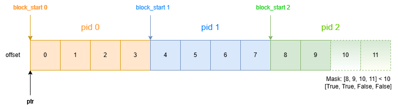
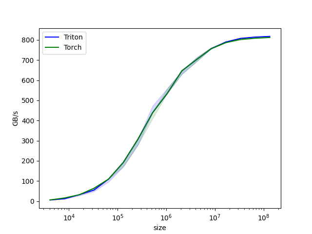

# Triton笔记一

- [Triton笔记一](#triton笔记一)
  - [Overview](#overview)
  - [Triton安装](#triton安装)
  - [GPU 编程的挑战](#gpu-编程的挑战)
  - [Programming Model](#programming-model)
  - [Vector ADD 例子](#vector-add-例子)
    - [Vector ADD Kernel](#vector-add-kernel)
    - [Vector ADD Host Code](#vector-add-host-code)
    - [Vector ADD Benchmark](#vector-add-benchmark)
    - [Vector ADD Triton vs PTX](#vector-add-triton-vs-ptx)
  - [Heigh-level system architecture](#heigh-level-system-architecture)
  - [Compiler backend](#compiler-backend)
  - [How does it fit in a DNN stack?](#how-does-it-fit-in-a-dnn-stack)
  - [How does the compiler simplify user's work?](#how-does-the-compiler-simplify-users-work)
  - [References](#references)

## Overview

OpenAI提供了一个blog:[Introducing Triton: Open-source GPU programming for neural networks](https://openai.com/index/triton/)来介绍Triton的设计想法和目标。

What is triton？

Triton是一个开源的Python-like语言（实际上我更想称它为Python-based的DSL语言），它用于帮助我们在没有CUDA经验的情况下就能写出高效~~GPU代码~~(kernel)，而达成这个目标的方法就是编译。所以Triton不只是一个Python-based的DSL语言，同时又是一个编译器。由于GPU编程本身的复杂性和难度，使得用户写出一个高效的算法变得比较困难，虽然现在有一些系统来简化这个过程，但是依然缺乏灵活性，因此Triton应运而生。

>We’re releasing Triton 1.0, an open-source Python-like programming language which enables researchers with no CUDA experience to write highly efficient GPU code — most of the time on par with what an expert would be able to produce.

更具体来说，Triton想要用户用较少的努力就可以写出一个达到硬件性能巅峰的kernel。比如要写一个FP16的矩阵乘法的kernel，让它的性能达到cublas的水平，只需要不到25行代码。甚至能写出比Torch的性能高两倍的kernel。

## Triton安装

From pips

```shell
pip install triton
```

From source

```shell
git clone https://github.com/triton-lang/triton.git;
cd triton/python;
pip install ninja cmake wheel; # build-time dependencies
pip install -e .
```

## GPU 编程的挑战

现代的GPU架构由三个主要部分构成：

1. DRAM：Dynamic Random Access Memory，GPU中的主要内存，通常用作现存；
2. SRAM：Static Random Access Memory，价格更加昂贵，但是访问速度更快，所以主要用于存储临时数据和需要频繁访问的数据；
3. ALUs：Arithmetic Logic Units，算术逻辑单元，负责执行算术运算（如加法、减法、乘法等）和逻辑运算（如与、或、非等）；


在优化CUDA代码的时候，需要综合考虑到这三个组件：

1. DRAM的内存传输必须合并成大型事务，以利用现代内存接口的大总线宽度（内存合并访问）；
2. 数据必须在重复使用前手动存储到SRAM，并且进行管理来最小化检索时的共享内存冲突（minimize shared memory bank conflicts）；
3. 计算必须在SM之间和它们内部被小心地划分和调度，来提升指令或者线程级别的并行度，并且利用专用的ALU（如Tensor Core）；

即使对一个非常有经验的CUDA开发人员来说这些问题依然是一个挑战。而Triton的目标就是能完全自动化这些优化，使得用户能够关注他们代码的高层逻辑。Triton 的目标是广泛适用，因此不会自动安排跨 SM 的工作 - 将一些重要的算法考虑因素（如tiling, inter-SM synchronization）留给开发人员自行决定。

文章中给出的图很明确地写明了CUDA和Triton的区别：


## Programming Model

在类似的DSL+Compiler的中，Triton和Numba最为接近（Numba我之前也没有详细看过）：

1. Kernel通过被装饰的Python函数来定义；
2. 以不同的program_id并行启动在grid实例上；

Triton编程模型中最大的特点就是Triton不是SIMT的模式，而是只通过对block的操作来实现并行，从而规避了很多和CUDA Thread相关的问题（如memory coalescing, shared memory synchronization/conflicts, tensor core scheduling）

文中给出了一个Vector Add的例子，对比了Triton和Numba的使用

```python
BLOCK = 512

# This is a GPU kernel in Numba.
# Different instances of this
# function may run in parallel.
@jit
def add(X, Y, Z, N):
   # In Numba/CUDA, each kernel 
   # instance itself uses an SIMT execution
   # model, where instructions are executed in
   # parallel for different values of threadIdx
   tid = threadIdx.x
   bid = blockIdx.x
   # scalar index
   idx = bid * BLOCK + tid
   if id < N:
     # There is no pointer in Numba.
     # Z,X,Y are dense tensors
     Z[idx] = X[idx] + Y[idx]


...
grid = (ceil_div(N, BLOCK),)
block = (BLOCK,)
add[grid, block](x, y, z, x.shape[0])
```

```python
BLOCK = 512

# This is a GPU kernel in Triton.
# Different instances of this
# function may run in parallel.
@jit
def add(X, Y, Z, N):
   # In Triton, each kernel instance
   # executes block operations on a
   # single thread: there is no construct
   # analogous to threadIdx
   pid = program_id(0)
   # block of indices
   idx = pid * BLOCK + arange(BLOCK)
   mask = idx < N
   # Triton uses pointer arithmetics  
   # rather than indexing operators
   x = load(X + idx, mask=mask)
   y = load(Y + idx, mask=mask)
   store(Z + idx, x + y, mask=mask)
...
grid = (ceil_div(N, BLOCK),)
# no thread-block
add[grid](x, y, z, x.shape[0])
```

虽然这可能对并行计算没有很大的帮助（如elementwise）但是确实可以一定程度上简化复杂的计算。

## Vector ADD 例子

为了能够给后面的学习打一个好的基础，首先来具体分析一下Vector Add，以它为例子，入门Triton的基本语法。

这也是Triton官方文档的tutorial中的第一个例子，这个例子比上面的代码在变量命名、注释方面更加详细(完整代码../triton-examples/00.vector-add.py)：

### Vector ADD Kernel

这个例子中涉及了使用triton编写kernel的几个要点：

1. kernel函数必须要被`@trition.jit`装饰器所装饰（暂时先不关心jit内做了什么）
2. tirton的kernle支持的参数类型只有：torch Tensor、int、float、tl.constexpr
3. pid：program_id，每一个program处理一个block size大小的数据，对于vector add这个例子，如果输入是x[2048]个元素，block size设置为1024，则triton会使用两个program来处理数据
   1. Triton中program的概念类似于CUDA中的grid，都是一个三维数组，在CUDA中，通过block.x/y/z来获取grid的坐标，在Triton中通过tl.program_id(axis=0/1/2)来获取program的坐标
4. 我们只需要考虑一个block中要处理哪些数据，然后通过offset和mask选出这些数据。这里的block并不用再细分thread的概念了，相比CUDA还是简单很多
5. load/store
   1. 通过load操作从源数据中读取当前block要处理的数据，load会从HBM中加载数据到共享内存或者本地内存中，这取决于Triton编译器
   2. 通过store操作将当前block的结果存储到输出中，store会从存储中将计算结果加载到HBM中
6. 和正常写python一些实现计算操作

```python
import torch

import triton
import triton.language as tl

@triton.jit
def add_kernel(x_ptr,  # *Pointer* to first input vector.
               y_ptr,  # *Pointer* to second input vector.
               output_ptr,  # *Pointer* to output vector.
               n_elements,  # Size of the vector.
               BLOCK_SIZE: tl.constexpr,  # Number of elements each program should process.
               # NOTE: `constexpr` so it can be used as a shape value.
               ):
    # There are multiple 'programs' processing different data. We identify which program
    # we are here:
    pid = tl.program_id(axis=0)  # We use a 1D launch grid so axis is 0.
    # This program will process inputs that are offset from the initial data.
    # For instance, if you had a vector of length 256 and block_size of 64, the programs
    # would each access the elements [0:64, 64:128, 128:192, 192:256].
    # Note that offsets is a list of pointers:
    block_start = pid * BLOCK_SIZE
    offsets = block_start + tl.arange(0, BLOCK_SIZE)  # 当前program要处理的元素的坐标列表
    # Create a mask to guard memory operations against out-of-bounds accesses.
    mask = offsets < n_elements
    # Load x and y from DRAM, masking out any extra elements in case the input is not a
    # multiple of the block size.
    x = tl.load(x_ptr + offsets, mask=mask)
    y = tl.load(y_ptr + offsets, mask=mask)
    output = x + y
    # Write x + y back to DRAM.
    tl.store(output_ptr + offsets, output, mask=mask)
```

通过可视化来直观理解一下数据操作，假设当前输入由10个元素，block size设置为4，则：



所以，整体看下来kernel的编写是向量化编程，它的复杂度介于Numpy和CUDA之间。

### Vector ADD Host Code

有了kernel之后，需要有一个host函数来调用kernel，也就是下面的代码：

1. 创建output tensor
2. 获取block/program个数，也就是一个grid级别的tuple
3. kernel启动：`kernel_func[programs_shape_tuple](*args)`，这个和cuda启动kernel非常相似

```python
def add(x: torch.Tensor, y: torch.Tensor):
    # We need to preallocate the output.
    output = torch.empty_like(x)
    assert x.is_cuda and y.is_cuda and output.is_cuda
    n_elements = output.numel()
    # The SPMD launch grid denotes the number of kernel instances that run in parallel.
    # It is analogous to CUDA launch grids. It can be either Tuple[int], or Callable(metaparameters) -> Tuple[int].
    # In this case, we use a 1D grid where the size is the number of blocks:
    grid = lambda meta: (triton.cdiv(n_elements, meta["BLOCK_SIZE"]),)  # tuple！！
    # NOTE:
    #  - Each torch.tensor object is implicitly converted into a pointer to its first element.
    #  - `triton.jit`'ed functions can be indexed with a launch grid to obtain a callable GPU kernel.
    #  - Don't forget to pass meta-parameters as keywords arguments.
    add_kernel[grid](x, y, output, n_elements, BLOCK_SIZE=1024)
    # We return a handle to z but, since `torch.cuda.synchronize()` hasn't been called, the kernel is still
    # running asynchronously at this point.
    return output
```

接下来对add函数的使用就和使用普通函数没有什么区别了

```python
output_triton = add(x, y)
```

### Vector ADD Benchmark

Triton提供了一套内置的Benchmark工具来评估我们自己实现的Kernel和Torch之间的性能差距，例如对比我们实现的Vector ADD，只要使用triton.testing.do_bench就可以获得相关的性能指标。

do_bench的具体使用参考：[triton.testing.do_bench](https://triton-lang.org/main/python-api/generated/triton.testing.do_bench.html#triton.testing.do_bench)

这和我们写pytest之类的单元测试是没有什么区别的：

```python
@triton.testing.perf_report(
    triton.testing.Benchmark(
        x_names=['size'],  # Argument names to use as an x-axis for the plot.
        x_vals=[2**i for i in range(12, 28, 1)],  # Different possible values for `x_name`.
        x_log=True,  # x axis is logarithmic.
        line_arg='provider',  # Argument name whose value corresponds to a different line in the plot.
        line_vals=['triton', 'torch'],  # Possible values for `line_arg`.
        line_names=['Triton', 'Torch'],  # Label name for the lines.
        styles=[('blue', '-'), ('green', '-')],  # Line styles.
        ylabel='GB/s',  # Label name for the y-axis.
        plot_name='vector-add-performance',  # Name for the plot. Used also as a file name for saving the plot.
        args={},  # Values for function arguments not in `x_names` and `y_name`.
    ))
def benchmark(size, provider):
    x = torch.rand(size, device='cuda', dtype=torch.float32)
    y = torch.rand(size, device='cuda', dtype=torch.float32)
    quantiles = [0.5, 0.2, 0.8]  # 除了中位数外还要返回的数据百分位
    if provider == 'torch':
        ms, min_ms, max_ms = triton.testing.do_bench(lambda: x + y, quantiles=quantiles)
    if provider == 'triton':
        ms, min_ms, max_ms = triton.testing.do_bench(lambda: add(x, y), quantiles=quantiles)
    gbps = lambda ms: 3 * x.numel() * x.element_size() / ms * 1e-6  # numel()用于获取tensor的元素个数， element_size获取tensor中每个元素的的bytes大小，总的数据吞吐量GB/s计算过程为3个tensor的总bytes大小 / runtime计算的毫秒耗时, * 1e-6后或者GB/s千兆字节每秒的结果
    return gbps(ms), gbps(max_ms), gbps(min_ms)

benchmark.run(print_data=True, show_plots=True, save_path=".")
```

最后绘制出来的size-性能差距如图所示：



通过csv可以看到具体的数据，我们写的kernel和torch的kernel性能几乎没有差距：

```shell
           size      Triton       Torch
0        4096.0    9.600000    9.600000
1        8192.0   19.200000   19.200000
2       16384.0   38.400001   38.400001
3       32768.0   76.800002   63.999998
4       65536.0  127.999995  127.999995
5      131072.0  219.428568  219.428568
6      262144.0  341.333321  340.741786
7      524288.0  472.615390  472.615390
8     1048576.0  534.260858  558.545450
9     2097152.0  599.414644  599.414644
10    4194304.0  638.337688  646.736871
11    8388608.0  664.216187  664.216187
12   16777216.0  675.628857  677.958629
13   33554432.0  680.304525  682.666643
14   67108864.0  684.449075  686.840182
15  134217728.0  686.091204  687.741160
```

### Vector ADD Triton vs PTX

让我们逆向一下通过Triton生成的PTX，看看它对应的CUDA C代码是什么样子的。

在host代码里添加save ptx的代码

```python
def add(x: torch.Tensor, y: torch.Tensor):
    # We need to preallocate the output.
    output = torch.empty_like(x)
    assert x.is_cuda and y.is_cuda and output.is_cuda
    n_elements = output.numel()
    # The SPMD launch grid denotes the number of kernel instances that run in parallel.
    # It is analogous to CUDA launch grids. It can be either Tuple[int], or Callable(metaparameters) -> Tuple[int].
    # In this case, we use a 1D grid where the size is the number of blocks:
    grid = lambda meta: (triton.cdiv(n_elements, meta["BLOCK_SIZE"]),)
    # NOTE:
    #  - Each torch.tensor object is implicitly converted into a pointer to its first element.
    #  - `triton.jit`'ed functions can be indexed with a launch grid to obtain a callable GPU kernel.
    #  - Don't forget to pass meta-parameters as keywords arguments.
    add_kernel[grid](x, y, output, n_elements, BLOCK_SIZE=1024)
    # We return a handle to z but, since `torch.cuda.synchronize()` hasn't been called, the kernel is still
    # running asynchronously at this point.

    # save ptx
    print(dir(add_kernel.cache))
    with open("add_kernel.ptx", "w") as a:
        print(list(add_kernel.cache[0].values())[0].asm["ptx"], file=a)
    return output
```

可以获得一个add_kernel.ptx文件，打开能看到完整的ptx，比较长，只放代码在这里：

```c
//
// Generated by LLVM NVPTX Back-End
//

.version 8.2
.target sm_86
.address_size 64

	// .globl	add_kernel_0d1d2d3de

.visible .entry add_kernel_0d1d2d3de(
	.param .u64 add_kernel_0d1d2d3de_param_0,
	.param .u64 add_kernel_0d1d2d3de_param_1,
	.param .u64 add_kernel_0d1d2d3de_param_2,
	.param .u32 add_kernel_0d1d2d3de_param_3
)
.maxntid 128, 1, 1
{
	.reg .pred 	%p<7>;
	.reg .b32 	%r<33>;
	.reg .f32 	%f<25>;
	.reg .b64 	%rd<11>;
	.loc	1 17 0
$L__func_begin0:
	.loc	1 17 0

	ld.param.u64 	%rd7, [add_kernel_0d1d2d3de_param_0];
	ld.param.u64 	%rd8, [add_kernel_0d1d2d3de_param_1];

// ...... 省略

$L__pubTypes_end0:
	}
	.section	.debug_loc	{	}
```

因为官方没有现成的逆向工具，我们通过chatgpt来逆向一下，可以获得一个看上去正确的cuda代码 :)。通过这个方式，我们能一定程度上分析cuda c和triton之间的对应关系，进一步猜测Triton代码会做些什么

```c
#include <cuda_runtime.h>

__global__ void add_kernel_0d1d2d3de(float *x_ptr, float *y_ptr, float *output_ptr, int n_elements) {
    const int BLOCK_SIZE = 1024;
    const int ELEMENTS_PER_THREAD = BLOCK_SIZE / blockDim.x; // 每个线程处理的元素数

    // 计算块的起始位置
    int pid = blockIdx.x;
    int block_start = pid * BLOCK_SIZE;

    // 计算当前线程的起始位置
    int thread_start = block_start + threadIdx.x * ELEMENTS_PER_THREAD;

    // 每个线程处理ELEMENTS_PER_THREAD个元素
    for (int i = 0; i < ELEMENTS_PER_THREAD; ++i) {
        int index = thread_start + i;
        if (index < n_elements) {
            output_ptr[index] = x_ptr[index] + y_ptr[index];
        }
    }
}
```

- `__global__ void add_kernel_0d1d2d3de(float *input1, float *input2, float *output, int n)` 和 `def add_kernel(x_ptr, y_ptr,  output_ptr, n_elements, BLOCK_SIZE: tl.constexpr, )`: 这里参数上是一一对应的，只是没有了BLOCK_SIZE参数，triton中的Tensor参数实际上就是一个裸指针
- tl.program_id(0)映射到blockIdx.x
- tl.arange(0, BLOCK_SIZE_N)映射到threadIdx.x
- mask 映射到了 if condition

## Heigh-level system architecture

Triton的良好性能是由围绕TritonIR、LLVM IR构成的模块化体系结构带来的，它采用的结构是LLVM式的front、middle、backend的结构，其中multi-dimensional blocks of values是一等公民。

具体的IR转换过程如下图所示：

- Triton通过将Python的AST转换为Triton IR
- Triton优化过程将Triton IR转换为LLVM IR/MLIR
- 调用LLVM后端生成PTX
- 调用ptxas编译为cubin


jit装饰器的职责就是遍历python函数的AST生成符合SSA形式的Triton IR的。之后由Triton后端来对TritonIR进行优化和并行化相关的工作。之后转换成LLVM IR，然后借用LLVM后端生成PTX。

一张更加完整的架构图，其中Triton IR、Triton GPU IR是Triton的中间表达，Triton的大量优化都是在它们上实现的，它和LLVM IR类似，都是硬件无关的


更深入的来看从Triton IR到LLVM IR的过程，主要经历了一下几步：


## Compiler backend

Triton所采用block program的形式使得编译器可以自动执行各种重要的优化。用户只需要把任务划分好然后调度到SM上，具体的SM内部的优化由Triton来负责。

例如：

1. 通过查看计算密集型的block级别的OP（如tl.dot）的操作数可以自动加载到shared memory中；
2. 使用liveness analysis技术进行allocated/synchronized；

下面是一个典型的例子，Triton compiler通过分析block变量的生命周期来分配共享内存：

](../.images/allocate%20memoy%20by%20analyzing%20the%20live%20range.png)

Triton写的代码可以这么高效的其他原因是：

1. 通过跨SM并行执行kernel实例；
2. 在SM内部，通过分析每个block级别操作的迭代空间并将它划分到不同的SIMD单元中；

如下图所示（需要进一步研究）：


## How does it fit in a DNN stack?

我们所接触的正常的DNN Stack，通常的Compiler都是作用在图这一层的


Triton被用于实现自定义的op，在对上层引入，在kernel层经过转换后生成ptx代码


## How does the compiler simplify user's work?

对于简化用户编码来说，Triton确实做到了，我们只需要使用简单的Python代码就能实现一个性能达到某些优化后版本的性能。Triton的一些列预置优化降低了开发kernel的门槛。

但是，与之对应的，对于前端用户，它实际上是**黑盒**的，我们不知道Triton内部对这个kernel到底做了什么，只能知道它的功能是正确的。因此想要进一步去优化kernel需要深入进入Triton内部，已经分析PTX等IR来做，而不是通过我们实现的Python代码。

它还有一个明显的缺点：tile size必须是2的幂，不支持切片（todo：这个要进一步去分析底层）

因此，Triton更合适的是**迅速**构建一个原型，做一些实验我们的**新算子**是否有效。

## References

- [Introducing Triton: Open-source GPU programming for neural networks](https://openai.com/index/triton/)  必看
- [Triton’s documentation!](https://triton-lang.org/main/index.html)  必看
- [Lightning Talk: Triton Compiler - Thomas Raoux, OpenAI](https://www.youtube.com/watch?v=AtbnRIzpwho&t=194s)  低质量
- [Understanding the Triton Tutorials Part 1](https://isamu-website.medium.com/understanding-the-triton-tutorials-part-1-6191b59ba4c)  高质量
- [Demystify OpenAI Triton](https://fkong.tech/posts/2023-04-23-triton-cuda/) 高质量