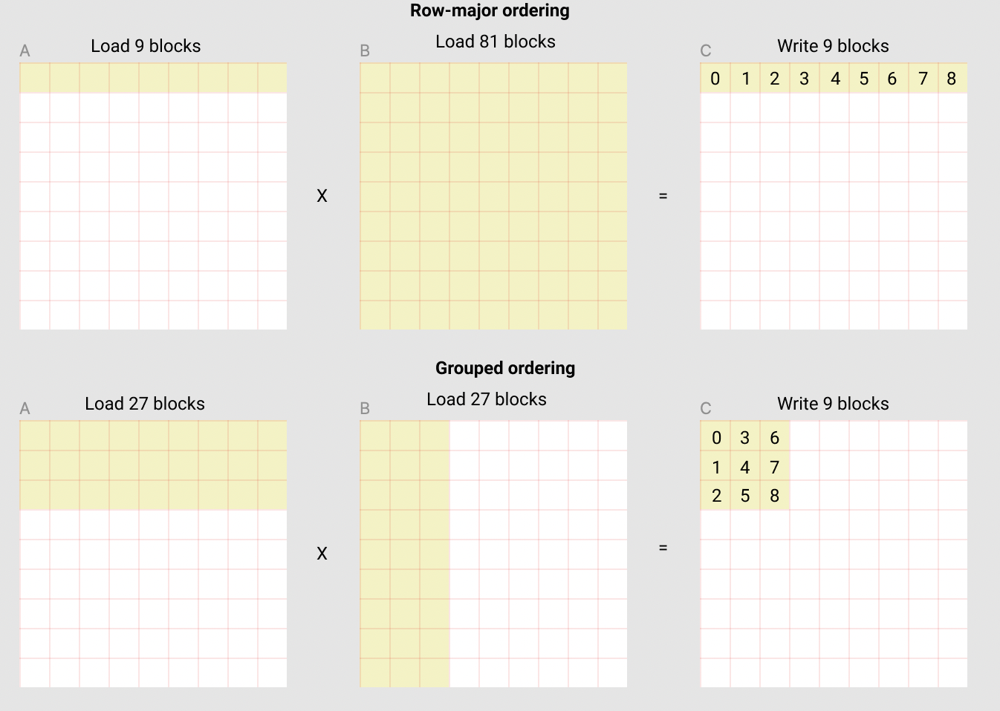

# Triton笔记二

- [Triton笔记二](#triton笔记二)
  - [Motivations](#motivations)
  - [Compute Kernel](#compute-kernel)
    - [Pointer Arithmetic](#pointer-arithmetic)
    - [L2 Cache Optimizations](#l2-cache-optimizations)


## Motivations

传统的情况下，我们开发应用会选择使用厂商提供的计算库中的矩阵乘计算，例如cublas库，但是这种类型的库通常都是不开源的，对于现在更加多样的深度学习场景，我们很难去二次开发它。

相比之下，Triton的优势就非常的明显了，我们可以轻松的使用它来开发一些fused kernel，最典型的就是把activation和matrix multiplication结合起来。

## Compute Kernel

首先通过伪代码来看Triton中的(M, K) * (K, N)的矩阵乘的blocked算法。

```python
for m in range(0, M, BLOCK_SIZE_M):
    for n in range(0, N, BLOCK_SIZE_N):
        acc = zeros((BLOCK_SIZE_M, BLOCK_SIZE_N), dtype=float32)
        for k in range(0, K, BLOCK_SIZE_K):
            a = A[m : m+BLOCK_SIZE_M, k : k+BLOCK_SIZE_K]
            b = B[k : k+BLOCK_SIZE_K, n : n+BLOCK_SIZE_N]
            acc += dot(a, b)
        C[m : m+BLOCK_SIZE_M, n : n+BLOCK_SIZE_N] = acc
```

其中主要的点在于，最内层的循环中需要从A、B矩阵中读出block块。因此，在这里需要引入multi-dimensional pointer运算。

### Pointer Arithmetic

对于行主序的2D矩阵x，想要通过指针来访问对应下标中的元素，公式为：

```python
X[i, j] = X_ptr + i * stride_xi + j * stride_xj
```

因此，如果要访问一个block的元素，采用类似的

```python
&A[m : m+BLOCK_SIZE_M, k:k+BLOCK_SIZE_K] =  a_ptr + (m : m+BLOCK_SIZE_M)[:, None]*A.stride(0) + (k : k+BLOCK_SIZE_K)[None, :]*A.stride(1);
&B[k : k+BLOCK_SIZE_K, n:n+BLOCK_SIZE_N] =  b_ptr + (k : k+BLOCK_SIZE_K)[:, None]*B.stride(0) + (n : n+BLOCK_SIZE_N)[None, :]*B.stride(1);
```

接下来就是Triton的实现，这里要注意的是Triton中M、N必须要是BLOCK_SIZE_M和BLOCK_SIZE_N的整数倍，如果不是的话，则需要一些空值来填充。

```python
offs_am = (pid_m * BLOCK_SIZE_M + tl.arange(0, BLOCK_SIZE_M)) % M
offs_bn = (pid_n * BLOCK_SIZE_N + tl.arange(0, BLOCK_SIZE_N)) % N
offs_k = tl.arange(0, BLOCK_SIZE_K)
a_ptrs = a_ptr + (offs_am[:, None]*stride_am + offs_k [None, :]*stride_ak)
b_ptrs = b_ptr + (offs_k [:, None]*stride_bk + offs_bn[None, :]*stride_bn)
a_ptrs += BLOCK_SIZE_K * stride_ak;
b_ptrs += BLOCK_SIZE_K * stride_bk;
```

### L2 Cache Optimizations

每一个program可以计算得到c中的一个[BLOCK_SIZE_M, BLOCK_SIZE_N]的block。

为了保证L2 Cache的命中率，这些block的顺序非常重要，但不幸的是，对于简单的行主序不会切分它。

```python
pid = tl.program_id(axis=0)
grid_n = tl.cdiv(N, BLOCK_SIZE_N)
pid_m = pid // grid_n
pid_n = pid % grid_n
```

一种可能的解决方案是按照促进数据重用的顺序启动block。triton可以通过在切换到下一列之前的super-grouping block来完成：

```python
# Program ID
pid = tl.program_id(axis=0)
# Number of program ids along the M axis
num_pid_m = tl.cdiv(M, BLOCK_SIZE_M)
# Number of programs ids along the N axis
num_pid_n = tl.cdiv(N, BLOCK_SIZE_N)
# Number of programs in group
num_pid_in_group = GROUP_SIZE_M * num_pid_n
# Id of the group this program is in
group_id = pid // num_pid_in_group
# Row-id of the first program in the group
first_pid_m = group_id * GROUP_SIZE_M
# If `num_pid_m` isn't divisible by `GROUP_SIZE_M`, the last group is smaller
group_size_m = min(num_pid_m - first_pid_m, GROUP_SIZE_M)
# *Within groups*, programs are ordered in a column-major order
# Row-id of the program in the *launch grid*
pid_m = first_pid_m + ((pid % num_pid_in_group) % group_size_m)
# Col-id of the program in the *launch grid*
pid_n = (pid % num_pid_in_group) // group_size_m
```

这样看代码还是很抽象，但是可视化来看，就非常的清楚了：

1. 行主序（row-major ordering）：读入90个block，写9个block
2. 组序（grouped ordering）：读入54个block，写9个block



