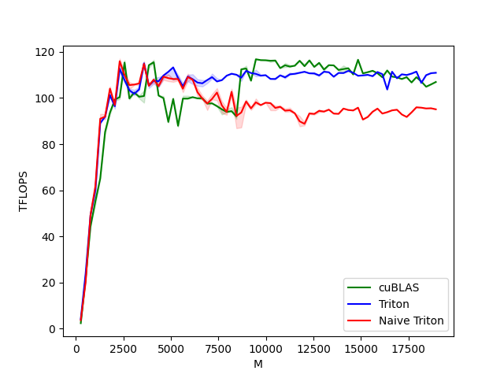

# Triton笔记二

- [Triton笔记二](#triton笔记二)
  - [Overview](#overview)
    - [基本步骤](#基本步骤)
    - [Pointer Arithmetic](#pointer-arithmetic)
    - [L2 Cache Optimizations](#l2-cache-optimizations)
  - [实现](#实现)
  - [Compute Kernel](#compute-kernel)
    - [函数定义](#函数定义)
    - [Program 概念](#program-概念)
    - [Block 概念](#block-概念)
    - [Kernel Fusion](#kernel-fusion)
  - [代码和性能](#代码和性能)
  - [References](#references)


## Overview

传统的情况下，我们开发应用会选择使用厂商提供的计算库中的矩阵乘计算，例如cublas库，但是这种类型的库通常都是不开源的，对于现在更加多样的深度学习场景，我们很难去二次开发它。

相比之下，Triton的优势就非常的明显了，我们可以轻松的使用它来开发一些**fused kernel**，最典型的就是把activation和matrix multiplication结合起来。

对于MM的优化，其实大概的思路都差不多，因为总的计算量一定是不变的，所以能做的事情就是尽可能地使用shared memory，提高**cache hit rate**。

cache hit rate 理解为尽可能的数据复用。小矩阵通常能够被放入cache中。

shared memory(L1 Cache)每次从global memory获取需要的数据时，会先去L2 Cache看是否存在，如果有就不用再去global memory了，有的概率越高，意味着cache hit rate越高。

所以我们希望尽可能的利用SRAM，但是因为它的空间比较小，所以基本原则是：每次往SRAM移动的数据，都要尽可能的被利用，避免来来回回搬迁。因此，更小的分块有利于提高缓存命中率。

除了上述两点，Triton另一个比较有意思的特点是，其操作的粒度大体来说既不是在标量这样细的颗粒度，也不是在Tensor这样相对高层次的颗粒度，而是在**Block或Tile**这种距离AI加速器更近的粒度(注: Block更像是一种逻辑概念，因为 其可以基于Tensor这一数据类型，配合一些属性完成定义)。一言以概，使用Triton开发kernel，Block这个层次的逻辑需要用户来处理，比如输入输出数据的分拆，Block粒度的数据累加等等。

### 基本步骤

1. 分析并行性并拆分，也就是定义好grid，并明确每个program要完成的运算范围；
2. 根据范围计算index偏移，并将其转换为一维指针的偏移形式，然后将数据从DRAM中load；
3. 使用加载过的数据进行运算，如果运算范围较大，需要使用循环逐段完成；

### Pointer Arithmetic

对于内存中连续存储的2D矩阵x，想要通过指针来访问对应下标中的元素，要借助row和col方向上的stride，公式为：

```python
X[i, j] = X_ptr + i * stride_xi + j * stride_xj
```

因此，如果要访问一个block的元素，采用类似的

```python
&A[m : m+BLOCK_SIZE_M, k : k+BLOCK_SIZE_K] = a_ptr + (m : m+BLOCK_SIZE_M)[:, None] * A.stride(0) + (k : k+BLOCK_SIZE_K)[None, :]*A.stride(1);
&B[k : k+BLOCK_SIZE_K, n : n+BLOCK_SIZE_N] = b_ptr + (k : k+BLOCK_SIZE_K)[:, None] * B.stride(0) + (n : n+BLOCK_SIZE_N)[None, :]*B.stride(1);
```

`[:, None]`是python支持的用法，用于在保证原始数据不变的情况下追加新维度。

```python
>>> import numpy as NP
>>> a = NP.arange(1,5)
>>> print(a)
[1 2 3 4]
>>> print(a.shape)
(4,)
>>> print(a[:,None].shape)
(4, 1)
>>> print(a[:,None])
[[1]
 [2]
 [3]
 [4]]
>>> print(a[:,None] * 10)
[[10]
 [20]
 [30]
 [40]]
>>> b = NP.arange(1, 10)
>>> print(b.shape)
(9,)
>>> print(b[None, :])
[[1 2 3 4 5 6 7 8 9]]
>>> print(b[None, :].shape)
(1, 9)
>>> print(a[:,None] * 10 + b[None, :])
[[11 12 13 14 15 16 17 18 19]
 [21 22 23 24 25 26 27 28 29]
 [31 32 33 34 35 36 37 38 39]
 [41 42 43 44 45 46 47 48 49]]
```

### L2 Cache Optimizations


每一个program可以计算得到C中的一个[BLOCK_SIZE_M, BLOCK_SIZE_N]的block。

为了保证L2 Cache的命中率，这些block的顺序非常重要。

如果采用传统的行主序的形式（也就是从左到右，从上到下，一个一个block的按顺序计算），triton实现如下：

```python
@triton.autotune(
    configs=get_autotune_config(),
    key=["M", "N", "K"],
)
@triton.jit
def naive_matmul_kernel(
    # Pointers to matrices
    a_ptr,
    b_ptr,
    c_ptr,
    # Matrix dimensions
    M,
    N,
    K,
    # The stride variables represent how much to increase the ptr by when moving by 1
    # element in a particular dimension. E.g. `stride_am` is how much to increase `a_ptr`
    # by to get the element one row down (A has M rows).
    stride_am,  # m维度+1的stride
    stride_ak,  # k维度+1的stride
    stride_bk,
    stride_bn,  #
    stride_cm,
    stride_cn,
    # Meta-parameters
    BLOCK_SIZE_M: tl.constexpr,
    BLOCK_SIZE_N: tl.constexpr,
    BLOCK_SIZE_K: tl.constexpr,  #
    GROUP_SIZE_M: tl.constexpr,  #
    ACTIVATION: tl.constexpr,  #
):
    pid = tl.program_id(0)
    block_num_m = (M + BLOCK_SIZE_M - 1) // BLOCK_SIZE_M
    block_num_n = (N + BLOCK_SIZE_N - 1) // BLOCK_SIZE_N

    pid_m = pid // block_num_n
    pid_n = pid % block_num_n

    offs_am = pid_m * BLOCK_SIZE_M + tl.arange(0, BLOCK_SIZE_M)
    offs_bn = pid_n * BLOCK_SIZE_N + tl.arange(0, BLOCK_SIZE_N)
    offs_k = tl.arange(0, BLOCK_SIZE_K)

    a_ptrs = a_ptr + (offs_am[:, None] * stride_am + offs_k[None, :] * stride_ak)
    b_ptrs = b_ptr + (offs_k[:, None] * stride_bk + offs_bn[None, :] * stride_bn)

    accumulator = tl.zeros([BLOCK_SIZE_M, BLOCK_SIZE_N], dtype=tl.float32)

    for k in range(0, K, BLOCK_SIZE_K):
        a = tl.load(a_ptrs, mask=offs_k[None, :] < K - k, other=0.0)
        b = tl.load(b_ptrs, mask=offs_k[:, None] < K - k, other=0.0)
        accumulator += tl.dot(a, b)
        a_ptrs += BLOCK_SIZE_K * stride_ak
        b_ptrs += BLOCK_SIZE_K * stride_bk

    if ACTIVATION == "leaky_relu":
        accumulator = leaky_relu(accumulator)
    out = accumulator.to(tl.float16)

    offs_cm = pid_m * BLOCK_SIZE_M + tl.arange(0, BLOCK_SIZE_M)
    offs_cn = pid_n * BLOCK_SIZE_N + tl.arange(0, BLOCK_SIZE_N)
    out_ptrs = c_ptr + offs_cm[:, None] * stride_cm + offs_cn[None, :] * stride_cn
    tl.store(out_ptrs, out, mask=((offs_cm[:, None] < M) & (offs_cn[None, :] < N)))
```

一种可能的解决方案是按照促进数据重用的顺序启动block。triton可以通过在切换到下一列之前的super-grouping block来完成：

```python
# Program ID
pid = tl.program_id(axis=0)
# Number of program ids along the M axis
num_pid_m = tl.cdiv(M, BLOCK_SIZE_M)
# Number of programs ids along the N axis
num_pid_n = tl.cdiv(N, BLOCK_SIZE_N)
# Number of programs in group
num_pid_in_group = GROUP_SIZE_M * num_pid_n
# Id of the group this program is in
group_id = pid // num_pid_in_group
# Row-id of the first program in the group
first_pid_m = group_id * GROUP_SIZE_M
# If `num_pid_m` isn't divisible by `GROUP_SIZE_M`, the last group is smaller
group_size_m = min(num_pid_m - first_pid_m, GROUP_SIZE_M)
# *Within groups*, programs are ordered in a column-major order
# Row-id of the program in the *launch grid*
pid_m = first_pid_m + ((pid % num_pid_in_group) % group_size_m)
# Col-id of the program in the *launch grid*
pid_n = (pid % num_pid_in_group) // group_size_m
```

这样看代码还是很抽象，但是可视化来看，就非常的清楚了，下面这种grouped ordering的方式，可以尽可能的提高cache hit rate，如果对于计算相同量级的C block，需要加载的block更少，因此对于默认将数据加载到L2 Cache区域的GPU来说，这种方式更加的友好

1. row-major ordering：读入90个block，写9个block
2. grouped ordering：读入54个block，写9个block


实现上，我们采用对A的黄色区域行方向滚动，B的黄色区域列方向滚动，在C的黄色区域上不断的累加。分块计算过程中，C的块将会按图中index顺序，逐个被计算出来。

## 实现

## Compute Kernel

首先通过伪代码来看Triton中的(M, K) * (K, N) = (M, N)的矩阵乘的blocked算法。

```python
# M 维度上每次取BLOCK_SIZE_M大小的数据，m为当前block在M维度上的起始位置
for m in range(0, M, BLOCK_SIZE_M):
    # N 维度上每次取BLOCK_SIZE_N大小的数据，n为当前block在N维度上的起始位置
    for n in range(0, N, BLOCK_SIZE_N):
        # acc用于存储输出矩阵的一个块，因此大小是(BLOCK_SIZE_M, BLOCK_SIZE_N)
        acc = zeros((BLOCK_SIZE_M, BLOCK_SIZE_N), dtype=float32)
        # 固定了M和N维度后，在K维度上滑动，每次的窗口大小是BLOCK_SIZE_K
        for k in range(0, K, BLOCK_SIZE_K):
            # 读取a block
            a = A[m : m+BLOCK_SIZE_M, k : k+BLOCK_SIZE_K]
            # 读取b block
            b = B[k : k+BLOCK_SIZE_K, n : n+BLOCK_SIZE_N]
            # a block和b block进行矩阵乘，获取到输出block的一部分
            acc += dot(a, b)
        # K维度上滑动完，获取到完成的输出block
        C[m : m+BLOCK_SIZE_M, n : n+BLOCK_SIZE_N] = acc
```

从代码中可以看到，A和B都是分块的来取数据的，计算得到的结果也是C中的一块，当前M、N方向上的BLOCK_SIZE大小的数据，可以在K方向上不断滑动，相当于每次计算C的一块的一部分数据，滑动的过程就是累加的过程。

### 函数定义

```python
@triton.jit
def matmul_kernel(
    # Pointers to matrices
    a_ptr,
    b_ptr,
    c_ptr,
    # Matrix dimensions
    M,
    N,
    K,
    # The stride variables represent how much to increase the ptr by when moving by 1
    # element in a particular dimension. E.g. `stride_am` is how much to increase `a_ptr`
    # by to get the element one row down (A has M rows).
    stride_am,
    stride_ak,  #
    stride_bk,
    stride_bn,  #
    stride_cm,
    stride_cn,
    # Meta-parameters
    BLOCK_SIZE_M: tl.constexpr,
    BLOCK_SIZE_N: tl.constexpr,
    BLOCK_SIZE_K: tl.constexpr,  #
    GROUP_SIZE_M: tl.constexpr,  #
    ACTIVATION: tl.constexpr,  #
)
```

1. `a_ptr`、`b_ptr`、`c_ptr`：tensor的指针，第一个元素的地址；
2. strides：和我们在torch中看到的stride是同一个概念，strid0对应0维+1需要的stride，stride1对应1维+1需要的stride，如果shape是一个(3,4)的tensor，那么它的stride是(4,1)；
3. Meta-parameters：剩下的tl.constexpr都是超参数l，在triton中超参数通过triton.Config和triton.autotune来设置；

### Program 概念

```python
pid = tl.program_id(axis=0)
```

这是在vector add用例中就已经看过的内容。在kernel中，写成只处理C的一部分输出的形式，但是执行完kernel后可以得到完成的C的原因，就是program在发挥它的作用。

program可以理解成循环，program_id理解成循环的index。

axis理解为嵌套的循环中有第几层循环，axis=0意味着只有一层循环，axis=1意味着有两层嵌套的循环，以此类推。

设置循环的层数的地方在host代码中调用kernel的位置。

也就是这里的grid，它被定义为了一个lambda函数，它的值和输入x的M、N维度以及BLOCK_SIZE有关系，是一个一维值。能够和kernel内的axis=0对应上，都是一层的。

```python
grid = lambda META: (
    triton.cdiv(M, META["BLOCK_SIZE_M"]) * triton.cdiv(N, META["BLOCK_SIZE_N"]),
)
matmul_kernel[grid](
    a,
    b,
    c,  #
    M,
    N,
    K,  #
    a.stride(0),
    a.stride(1),  #
    b.stride(0),
    b.stride(1),  #
    c.stride(0),
    c.stride(1),  #
    ACTIVATION=activation,  #
)
```

### Block 概念

Block的概念，就是建立在program基础之上。

前面说了program理解为循环，每一个index对应了输出C矩阵中的一部分，这一部分就是我们说的block，block的大小是${BLOCK\_SIZE\_M} \times {BLOCK\_SIZE\_N}$，则循环的次数就是$\frac{M}{BLOCK\_SIZE\_M} \times \frac{N}{BLOCK\_SIZE\_N}$。

也就是说，完成$A\times B=C$，A的大小是$M \times K$，B的大小是$K \times N$，的运算，我们需要计算$\frac{M}{BLOCK\_SIZE\_M} \times \frac{N}{BLOCK\_SIZE\_N}$个block的内容。对于上面的图，grid=81。

所以，从block的角度，就是上面的super grouped ordering：先计算9个blocks，组合成一个大的super block，在进行下一个super block。

它的好处就是：

1. 同样都是计算9个block，读入的block更少
2. cache hit rate更高

对于输出C，它需要计算0到80的81个block。当program在axis=0维度上递增时，我们期望形成一下的代码逻辑： (pid_m, pid_n) 是黄色小块的坐标, 

```c++
for pid in range(81):
    pid --> (pid_m, pid_n)
```

对应到triton中的实现，我们要做的就是把pid转换为pid_m和pid_n，让pid_m按照(0,1,2,0,1,2,...,0,1,2)的序列变化，让pid_n按照(0,0,0,1,1,1,2,2,2,...,8,8,8)的序列变化，这样(pid_m,pid_n)组合可以生成(0,0),(1,0),(2,0),(0,1),(1,1),(1,2),...,(0,8),(1,8),(2,8)的序列。

```python
# Program ID
pid = tl.program_id(axis=0)
# Number of program ids along the M axis
num_pid_m = tl.cdiv(M, BLOCK_SIZE_M)
# Number of programs ids along the N axis
num_pid_n = tl.cdiv(N, BLOCK_SIZE_N)
# Number of programs in group
# 下图中红框部分的block数，高GROUP_SIZE_M，宽num_pid_n。对应一个红框内的block，它们会依次计算
num_pid_in_group = GROUP_SIZE_M * num_pid_n
# Id of the group this program is in
# 红色框的id，当前pid在第几个group里
group_id = pid // num_pid_in_group
# Row-id of the first program in the group
# 当前group的第一个pid在第几行
first_pid_m = group_id * GROUP_SIZE_M
# If `num_pid_m` isn't divisible by `GROUP_SIZE_M`, the last group is smaller
# 因为最后一个group可能不满GROUP_SIZE_M行，所以需要获取当前pid的实际group size m，比如可能只有一行
group_size_m = min(num_pid_m - first_pid_m, GROUP_SIZE_M)
# *Within groups*, programs are ordered in a column-major order
# Row-id of the program in the *launch grid*
# pid % num_pid_in_group把所有pid都转换为0到num_pid_in_group-1的范围，在这里是（0-26）,group_size_m是3，计算得到目标block的行数
pid_m = first_pid_m + ((pid % num_pid_in_group) % group_size_m)
# Col-id of the program in the *launch grid*
# 同样的道理，计算得到目标block的列数
pid_n = (pid % num_pid_in_group) // group_size_m
```


前面还是从高层的角度看block和super group。下面深入到一个block中，也就是triton kernel实现的角度。


A中第一行的9个block和B中第一列的9个block逐个相乘，逐个放入accumulator累加器中，9个block计算完，accumulator累加器中的值也就是C中的第一个block。

所以，对于每一个pid，需要构造一个循环来读取A和B上的9个block。

首先，定位到开始的一个block

```python
# ----------------------------------------------------------
# Create pointers for the first blocks of A and B.
# We will advance this pointer as we move in the K direction
# and accumulate
# `a_ptrs` is a block of [BLOCK_SIZE_M, BLOCK_SIZE_K] pointers
# `b_ptrs` is a block of [BLOCK_SIZE_K, BLOCK_SIZE_N] pointers
# See above `Pointer Arithmetics` section for details
offs_am = (pid_m * BLOCK_SIZE_M + tl.arange(0, BLOCK_SIZE_M)) % M
offs_bn = (pid_n * BLOCK_SIZE_N + tl.arange(0, BLOCK_SIZE_N)) % N
offs_k = tl.arange(0, BLOCK_SIZE_K)
a_ptrs = a_ptr + (offs_am[:, None] * stride_am + offs_k[None, :] * stride_ak)
b_ptrs = b_ptr + (offs_k[:, None] * stride_bk + offs_bn[None, :] * stride_bn)
```

以第一个block为例：

- offs_am：A矩阵9个block中的第一个block中每个元素在整个A矩阵中的行坐标
- offs_bn：B矩阵9个block中的第一个block中每个元素在整个B矩阵中的列坐标
- offs_k：A矩阵的列坐标，B矩阵的行坐标
- a_ptr：A矩阵的第一个元素的地址
- b_ptr: B矩阵的第一个元素的地址

有了行列坐标之后，和stride相乘，即可以得到第一个block中每个元素的坐标a_ptr和b_ptrs

有了具体的坐标之后，进行乘加运算，这个运算过程其实就是一个block一个block的计算它们的矩阵乘法

```python
# -----------------------------------------------------------
# Iterate to compute a block of the C matrix.
# We accumulate into a `[BLOCK_SIZE_M, BLOCK_SIZE_N]` block
# of fp32 values for higher accuracy.
# `accumulator` will be converted back to fp16 after the loop.
accumulator = tl.zeros((BLOCK_SIZE_M, BLOCK_SIZE_N), dtype=tl.float32)
for k in range(0, tl.cdiv(K, BLOCK_SIZE_K)):
    # Load the next block of A and B, generate a mask by checking the K dimension.
    # If it is out of bounds, set it to 0.
    a = tl.load(a_ptrs, mask=offs_k[None, :] < K - k * BLOCK_SIZE_K, other=0.0)
    b = tl.load(b_ptrs, mask=offs_k[:, None] < K - k * BLOCK_SIZE_K, other=0.0)
    # We accumulate along the K dimension.
    accumulator += tl.dot(a, b)
    # Advance the ptrs to the next K block.
    a_ptrs += BLOCK_SIZE_K * stride_ak
    b_ptrs += BLOCK_SIZE_K * stride_bk
```

mask的作用是当K不能被BLOCK_SIZE_K整除时，到每一行最后一个block时，实际大小不足BLOCK_SIZE_K，需要使用mask遮蔽掉

```python
accumulator += tl.dot(a, b)
```

计算了一个block的值之后移动到下一个block的元素，因为都是在k方向移动，所以只要考虑k方向上的偏移就可以了，对于本例子，stride_ak是1，stride_bk是9，所以a的每个指针移动BLOCK_SIZE_K的位置，b的每个指针移动BLOCK_SIZE_K*9的位置。

```python
a_ptrs += BLOCK_SIZE_K * stride_ak
b_ptrs += BLOCK_SIZE_K * stride_bk
```

在k方向上移动完，也就得到了C中的第一个block，写回到DRAM中，即完成了第一个block的全部操作

和load时的思路一致，先找到偏移，`pid_m * BLOCK_SIZE_M`和`pid_n * BLOCK_SIZE_N`获取到m、n的起始坐标，再分别加上对应方向的偏移

```python
offs_cm = pid_m * BLOCK_SIZE_M + tl.arange(0, BLOCK_SIZE_M)
offs_cn = pid_n * BLOCK_SIZE_N + tl.arange(0, BLOCK_SIZE_N)
```

有了偏移之后，偏移和stride获取到实际的坐标，将c（也就是accumulator）写入到c_ptrs中。

```python
# -----------------------------------------------------------
# Write back the block of the output matrix C with masks.
offs_cm = pid_m * BLOCK_SIZE_M + tl.arange(0, BLOCK_SIZE_M)
offs_cn = pid_n * BLOCK_SIZE_N + tl.arange(0, BLOCK_SIZE_N)
c_ptrs = c_ptr + stride_cm * offs_cm[:, None] + stride_cn * offs_cn[None, :]
c_mask = (offs_cm[:, None] < M) & (offs_cn[None, :] < N)
tl.store(c_ptrs, c, mask=c_mask)
```

在上述的program基础上，叠加上program的并行化，81个block经过81个program计算后得到了完整的C矩阵。

### Kernel Fusion

我们一开始提到了，除了cache hit rate和block program这两个特点，triton的开发属性可以带来很好的算子融合特性，依旧以上面的matrix multiplication为例子，我们可以在完成一个block的计算后，直接使用elmentwised算子，例如leak_rule，这样经过triton编译之后，它们实际上是一个cuda kernel。

```python
accumulator = tl.zeros((BLOCK_SIZE_M, BLOCK_SIZE_N), dtype=tl.float32)
for k in range(0, tl.cdiv(K, BLOCK_SIZE_K)):
    # Load the next block of A and B, generate a mask by checking the K dimension.
    # If it is out of bounds, set it to 0.
    a = tl.load(a_ptrs, mask=offs_k[None, :] < K - k * BLOCK_SIZE_K, other=0.0)
    b = tl.load(b_ptrs, mask=offs_k[:, None] < K - k * BLOCK_SIZE_K, other=0.0)
    # We accumulate along the K dimension.
    accumulator = tl.dot(a, b, accumulator)
    # Advance the ptrs to the next K block.
    a_ptrs += BLOCK_SIZE_K * stride_ak
    b_ptrs += BLOCK_SIZE_K * stride_bk
# You can fuse arbitrary activation functions here
# while the accumulator is still in FP32!
if ACTIVATION == "leaky_relu":
    accumulator = leaky_relu(accumulator)
c = accumulator.to(tl.float16)
```

而这个leaky_rule操作可以是自己实现的

```python
# We can fuse `leaky_relu` by providing it as an `ACTIVATION` meta-parameter in `_matmul`.
@triton.jit
def leaky_relu(x):
    x = x + 1
    return tl.where(x >= 0, x, 0.01 * x)
```

## 代码和性能

代码：[../triton-examples/02.matrix-multiplication/matrix_multiplication.py](../triton-examples/02.matrix-multiplication/matrix_multiplication.py)

性能对比：



```
M,N,K,cuBLAS,Triton,Naive Triton
256.000000,256.000000,256.000000,2.340571,4.096000,3.640889
512.000000,512.000000,512.000000,21.845333,23.831273,20.164923
768.000000,768.000000,768.000000,44.236801,49.151998,49.151998
1024.000000,1024.000000,1024.000000,55.188213,59.918627,61.680940
1280.000000,1280.000000,1280.000000,65.015874,89.043476,91.022221
1536.000000,1536.000000,1536.000000,85.275760,91.920627,91.920627
1792.000000,1792.000000,1792.000000,93.661869,101.256071,104.068741
2048.000000,2048.000000,2048.000000,99.273464,96.420781,96.978131
2304.000000,2304.000000,2304.000000,100.369213,112.678642,115.960545
2560.000000,2560.000000,2560.000000,115.380278,107.789478,109.959732
2816.000000,2816.000000,2816.000000,99.803677,103.351201,105.603409
3072.000000,3072.000000,3072.000000,102.392589,101.840118,105.837578
3328.000000,3328.000000,3328.000000,100.546506,103.733858,106.338698
3584.000000,3584.000000,3584.000000,100.858547,115.054882,114.834469
3840.000000,3840.000000,3840.000000,114.247936,105.426125,105.325718
4096.000000,4096.000000,4096.000000,115.505790,107.460154,107.978861
4352.000000,4352.000000,4352.000000,101.060378,107.254618,105.152960
4608.000000,4608.000000,4608.000000,99.949255,109.766213,109.264134
4864.000000,4864.000000,4864.000000,89.615515,111.375477,108.630121
5120.000000,5120.000000,5120.000000,99.598784,113.286088,108.234515
5376.000000,5376.000000,5376.000000,87.935222,108.690702,108.225555
5632.000000,5632.000000,5632.000000,99.746614,105.062835,104.013611
5888.000000,5888.000000,5888.000000,99.746876,109.304527,109.110090
6144.000000,6144.000000,6144.000000,100.373326,108.201325,107.956352
6400.000000,6400.000000,6400.000000,99.863465,106.711135,102.523031
6656.000000,6656.000000,6656.000000,99.883863,106.368156,99.745471
6912.000000,6912.000000,6912.000000,97.604804,107.800865,97.619580
7168.000000,7168.000000,7168.000000,97.687666,109.054449,99.643047
7424.000000,7424.000000,7424.000000,96.460924,107.185992,102.386616
7680.000000,7680.000000,7680.000000,95.112453,107.750093,96.824732
7936.000000,7936.000000,7936.000000,93.995615,109.702922,93.963949
8192.000000,8192.000000,8192.000000,94.295410,110.524118,102.671813
8448.000000,8448.000000,8448.000000,92.049060,110.105993,92.229291
8704.000000,8704.000000,8704.000000,112.452064,108.794851,93.717553
8960.000000,8960.000000,8960.000000,112.791267,111.795015,98.515393
9216.000000,9216.000000,9216.000000,107.512221,110.856635,95.512689
9472.000000,9472.000000,9472.000000,116.813108,110.472728,98.143181
9728.000000,9728.000000,9728.000000,116.438656,109.697134,96.924465
9984.000000,9984.000000,9984.000000,116.379175,109.910376,97.972025
10240.000000,10240.000000,10240.000000,116.172830,108.279222,97.789841
10496.000000,10496.000000,10496.000000,116.265713,108.231064,95.695053
10752.000000,10752.000000,10752.000000,112.969547,109.833991,96.204306
11008.000000,11008.000000,11008.000000,114.204287,108.964445,94.527971
11264.000000,11264.000000,11264.000000,113.615647,110.271773,94.700910
11520.000000,11520.000000,11520.000000,114.025429,110.510141,93.379112
11776.000000,11776.000000,11776.000000,116.167905,110.950919,89.894621
12032.000000,12032.000000,12032.000000,113.793089,111.382664,88.807235
12288.000000,12288.000000,12288.000000,116.287864,110.711937,93.315967
12544.000000,12544.000000,12544.000000,113.494433,110.672847,93.099781
12800.000000,12800.000000,12800.000000,115.242306,109.799091,94.434450
13056.000000,13056.000000,13056.000000,112.344164,111.412629,94.128390
13312.000000,13312.000000,13312.000000,114.249220,111.171399,94.963583
13568.000000,13568.000000,13568.000000,114.157389,109.247703,93.259442
13824.000000,13824.000000,13824.000000,112.165477,110.870028,93.143552
14080.000000,14080.000000,14080.000000,112.551638,110.830983,95.425881
14336.000000,14336.000000,14336.000000,112.910279,111.776410,94.814643
14592.000000,14592.000000,14592.000000,110.234408,110.964093,94.608897
14848.000000,14848.000000,14848.000000,116.604597,109.653036,95.821921
15104.000000,15104.000000,15104.000000,110.693936,109.816084,90.657367
15360.000000,15360.000000,15360.000000,111.217602,110.058903,91.795447
15616.000000,15616.000000,15616.000000,111.818416,109.477957,94.051839
15872.000000,15872.000000,15872.000000,110.740520,111.281764,95.416230
16128.000000,16128.000000,16128.000000,109.000130,110.361110,93.268452
16384.000000,16384.000000,16384.000000,111.966195,103.706851,93.865730
16640.000000,16640.000000,16640.000000,109.290999,111.414039,94.658628
16896.000000,16896.000000,16896.000000,108.971195,108.576835,94.927183
17152.000000,17152.000000,17152.000000,108.251162,110.286270,92.872104
17408.000000,17408.000000,17408.000000,109.052791,109.977028,91.796294
17664.000000,17664.000000,17664.000000,106.755491,110.588595,93.763246
17920.000000,17920.000000,17920.000000,109.040161,111.455783,95.975683
18176.000000,18176.000000,18176.000000,107.202195,106.550631,95.816437
18432.000000,18432.000000,18432.000000,104.899866,109.912204,95.475403
18688.000000,18688.000000,18688.000000,105.899290,110.767181,95.559905
18944.000000,18944.000000,18944.000000,106.967252,110.952738,95.109157

```

## References

- [Triton tutorial matrix multiplication](https://triton-lang.org/main/getting-started/tutorials/03-matrix-multiplication.html#sphx-glr-getting-started-tutorials-03-matrix-multiplication-py) 必看
- [Triton编程入门 by 董鑫 Nvidia Researcher​](https://www.zhihu.com/question/622685131) 高质量
- [谈谈对OpenAI Triton的一些理解 by 杨军 Nvidia compute arch](https://zhuanlan.zhihu.com/p/613244988) 高质量
- [BBuf的CUDA笔记】十三，OpenAI Triton 入门笔记一](https://zhuanlan.zhihu.com/p/679232270) 高质量
- [Triton语言入门教程-智源人工智能研究院-20240602](https://www.bilibili.com/video/BV11y3ne9Ec5/?share_source=copy_web&vd_source=3157022a9ba8a59e9a2cac56650df970) 必看
- [如何高效实现矩阵乘？万文长字带你从CUDA初学者的角度入门](https://zhuanlan.zhihu.com/p/587304667) 高质量
- [lightllm代码解读番外篇——triton kernel撰写](https://zhuanlan.zhihu.com/p/666763592) 高质量
