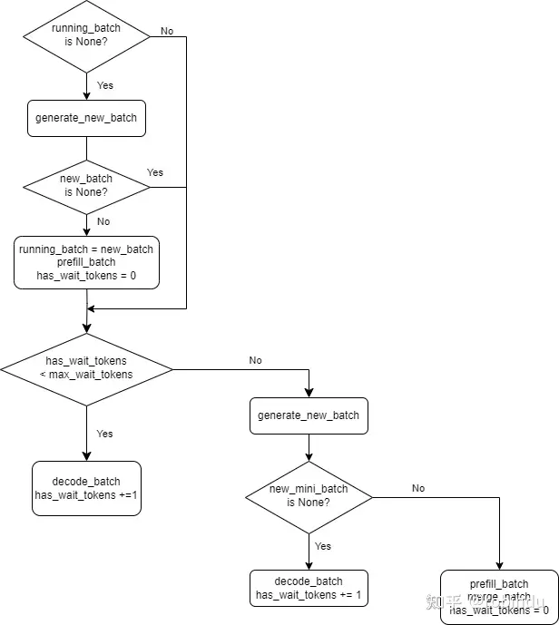

# 08.Triton笔记八：基于Triton的项目调研

- [08.Triton笔记八：基于Triton的项目调研](#08triton笔记八基于triton的项目调研)
  - [Overview](#overview)
    - [FlagGems](#flaggems)
      - [源码结构](#源码结构)
      - [绑定torch注册的方式](#绑定torch注册的方式)
      - [kernel实现](#kernel实现)
      - [运行时优化 LibEntry](#运行时优化-libentry)
      - [自动代码生成](#自动代码生成)
    - [FlagAttention](#flagattention)
    - [LightLLM](#lightllm)
      - [源码结构](#源码结构-1)
      - [httpserver](#httpserver)
      - [router](#router)
      - [model](#model)
      - [detokenization](#detokenization)
      - [总结](#总结)
  - [References](#references)

## Overview

目前社区中有很开源项目是基于Triton来实现的，尤其是大模型时代开始之后，本文是对这些项目的汇总解读

- FlagGems & FlagAttention：
  - https://github.com/FlagOpen/FlagGems
  - https://github.com/FlagOpen/FlagAttention
  - 智源研究院
  - 基于Triton的大模型算子库
- LightLLM
  - 商汤
  - https://github.com/ModelTC/lightllm/tree/main
  - 基于Python的大模型推理和服务框架，使用Triton实现了在各大模型中公用的算子集合，例如attention、layernorm等
- unsloth
  - https://github.com/unslothai/unsloth
  - Unsloth AI 美国公司，团队只有两人
  - 基于PyTorch的微调框架，算子使用Triton重写

### FlagGems

FlagGems是一个基于Triton实现的高效python算子库，它只提供大模型时代常用的一些训练和推理算子。它可以和torch进行深度的结合，通过

```python
import flag_gems
flag_gems.enable()
```

或者

```python
import torch
import flag_gems

M, N, K = 1024, 1024, 1024
A = torch.randn((M, K), dtype=torch.float16, device="cuda")
B = torch.randn((K, N), dtype=torch.float16, device="cuda")
with flag_gems.use_gems():
    C = torch.mm(A, B)
```

来选择使用flaggems还是torch的实现

#### 源码结构

```shell
|-- __init__.py
|-- fused
|   |-- __init__.py
|   |-- gelu_and_mul.py
|   |-- rotary_embedding.py
|   |-- silu_and_mul.py
|   |-- skip_layernorm.py
|   `-- skip_rms_norm.py
|-- ops
|   |-- __init__.py
|   |-- abs.py
|   |-- add.py
|   |-- addmm.py
|   |-- all.py
|   |-- amax.py
|   |-- any.py
|   |-- argmax.py
|   |-- bitwise_and.py
|   |-- bitwise_not.py
|   |-- bitwise_or.py
|   |-- bmm.py
|   |-- clamp.py
|   |-- cos.py
|   |-- cross_entropy_loss.py
|   |-- cumsum.py
|   |-- div.py
|   |-- dropout.py
|   |-- embedding.py
|   |-- eq.py
|   |-- exp.py
|   |-- flip.py
|   |-- ge.py
|   |-- gelu.py
|   |-- groupnorm.py
|   |-- gt.py
|   |-- isclose.py
|   |-- isfinite.py
|   |-- isinf.py
|   |-- isnan.py
|   |-- layernorm.py
|   |-- le.py
|   |-- log_softmax.py
|   |-- lt.py
|   |-- max.py
|   |-- mean.py
|   |-- min.py
|   |-- mm.py
|   |-- mul.py
|   |-- mv.py
|   |-- ne.py
|   |-- neg.py
|   |-- outer.py
|   |-- pow.py
|   |-- prod.py
|   |-- rand.py
|   |-- rand_like.py
|   |-- randn.py
|   |-- reciprocal.py
|   |-- relu.py
|   |-- rms_norm.py
|   |-- rsqrt.py
|   |-- sigmoid.py
|   |-- silu.py
|   |-- sin.py
|   |-- softmax.py
|   |-- sub.py
|   |-- sum.py
|   |-- tanh.py
|   |-- triu.py
|   |-- var_mean.py
|   |-- vector_norm.py
|   `-- where.py
`-- utils
    |-- __init__.py
    |-- code_cache.py
    |-- code_utils.py
    |-- libentry.py
    |-- pointwise_dynamic.py
    |-- random_utils.py
    |-- shape_utils.py
    `-- type_utils.py
```

#### 绑定torch注册的方式

因为FlagGems定位是一个纯python项目，所以它的算子注册方式是通过torch library来实现的，算子注册的实现在src/flag_gems/__init__.py中

```python
import torch

from .fused import *  # noqa: F403
from .ops import *  # noqa: F403

__version__ = "2.0"

aten_lib = torch.library.Library("aten", "IMPL")


def enable(lib=aten_lib):
    lib.impl("abs", abs, "CUDA")
    lib.impl("add.Tensor", add, "CUDA")
    lib.impl("addmm", addmm, "CUDA")
    lib.impl("bitwise_and.Tensor", bitwise_and_tensor, "CUDA")
    lib.impl("bitwise_and.Scalar", bitwise_and_scalar, "CUDA")
    lib.impl("bitwise_and.Scalar_Tensor", bitwise_and_scalar_tensor, "CUDA")
    lib.impl("bitwise_not", bitwise_not, "CUDA")
    lib.impl("bitwise_or.Tensor", bitwise_or_tensor, "CUDA")
    lib.impl("bitwise_or.Scalar", bitwise_or_scalar, "CUDA")
    lib.impl("bitwise_or.Scalar_Tensor", bitwise_or_scalar_tensor, "CUDA")
    lib.impl("bmm", bmm, "CUDA")
    lib.impl("clamp", clamp, "CUDA")
    lib.impl("clamp.Tensor", clamp_tensor, "CUDA")
    lib.impl("cos", cos, "CUDA")
    lib.impl("cumsum", cumsum, "CUDA")
    lib.impl("div.Tensor", div, "CUDA")
    lib.impl("native_dropout", native_dropout, "AutogradCUDA")
    lib.impl("embedding", embedding, "AutogradCUDA")
    lib.impl("eq.Tensor", eq, "CUDA")
    lib.impl("eq.Scalar", eq_scalar, "CUDA")
    lib.impl("exp", exp, "CUDA")
    lib.impl("ge.Tensor", ge, "CUDA")
    lib.impl("ge.Scalar", ge_scalar, "CUDA")
    lib.impl("gelu", gelu, "CUDA")
    lib.impl("native_group_norm", group_norm, "AutogradCUDA")
    lib.impl("gt.Tensor", gt, "CUDA")
    lib.impl("gt.Scalar", gt_scalar, "CUDA")
    lib.impl("isfinite", isfinite, "CUDA")
    lib.impl("isinf", isinf, "CUDA")
    lib.impl("isnan", isnan, "CUDA")
    lib.impl("native_layer_norm", layer_norm, "AutogradCUDA")
    lib.impl("le.Tensor", le, "CUDA")
    lib.impl("le.Scalar", le_scalar, "CUDA")
    lib.impl("lt.Tensor", lt, "CUDA")
    lib.impl("lt.Scalar", lt_scalar, "CUDA")
    lib.impl("rms_norm", rms_norm, "CUDA")
    lib.impl("rand", rand, "CUDA")
    lib.impl("randn", randn, "CUDA")
    lib.impl("rand_like", rand_like, "CUDA")

    lib.impl("mean", mean, "CUDA")
    lib.impl("mean.dim", mean_dim, "CUDA")
    lib.impl("mm", mm, "CUDA")
    lib.impl("mul.Tensor", mul, "CUDA")
    lib.impl("mv", mv, "CUDA")
    lib.impl("ne.Tensor", ne, "CUDA")
    lib.impl("ne.Scalar", ne_scalar, "CUDA")
    lib.impl("neg", neg, "CUDA")
    lib.impl("pow.Scalar", pow_scalar, "CUDA")
    lib.impl("pow.Tensor_Scalar", pow_tensor_scalar, "CUDA")
    lib.impl("pow.Tensor_Tensor", pow_tensor_tensor, "CUDA")
    lib.impl("reciprocal", reciprocal, "CUDA")
    lib.impl("relu", relu, "AutogradCUDA")
    lib.impl("rsqrt", rsqrt, "CUDA")
    lib.impl("sigmoid", sigmoid, "AutogradCUDA")
    lib.impl("silu", silu, "AutogradCUDA")
    lib.impl("sin", sin, "CUDA")
    lib.impl("softmax.int", softmax, "AutogradCUDA")
    lib.impl("sub.Tensor", sub, "CUDA")
    lib.impl("tanh", tanh, "AutogradCUDA")
    lib.impl("triu", triu, "CUDA")
    lib.impl("var_mean.correction", var_mean, "CUDA")
    lib.impl("linalg_vector_norm", vector_norm, "CUDA")
    lib.impl("where.self", where_self, "CUDA")
    lib.impl("where.ScalarSelf", where_scalar_self, "CUDA")
    lib.impl("where.ScalarOther", where_scalar_other, "CUDA")
    lib.impl("max", max, "CUDA")
    lib.impl("max.dim", max_dim, "CUDA")
    lib.impl("min", min, "CUDA")
    lib.impl("min.dim", min_dim, "CUDA")
    lib.impl("amax", amax, "CUDA")
    lib.impl("argmax", argmax, "CUDA")
    lib.impl("prod", prod, "CUDA")
    lib.impl("prod.dim_int", prod_dim, "CUDA")
    lib.impl("sum", sum, "CUDA")
    lib.impl("sum.dim_IntList", sum_dim, "CUDA")
    lib.impl("all", all, "CUDA")
    lib.impl("all.dim", all_dim, "CUDA")
    lib.impl("all.dims", all_dims, "CUDA")
    lib.impl("any", any, "CUDA")
    lib.impl("any.dim", any_dim, "CUDA")
    lib.impl("any.dims", any_dims, "CUDA")
    lib.impl("log_softmax.int", log_softmax, "AutogradCUDA")
    lib.impl("outer", outer, "AutogradCUDA")
    lib.impl("cross_entropy_loss", cross_entropy_loss, "AutogradCUDA")
    lib.impl("isclose", isclose, "CUDA")
    lib.impl("allclose", allclose, "CUDA")
    lib.impl("flip", flip, "CUDA")


class use_gems:
    def __init__(self):
        self.lib = torch.library.Library("aten", "IMPL")

    def __enter__(self):
        enable(self.lib)

    def __exit__(self, exc_type, exc_val, exc_tb):
        del self.lib


__all__ = [
    "enable",
    "use_gems",
]
```

#### kernel实现

以addmm为例子，实现方面和之前看过的mm没有什么区别，不再具体分析

```python
import logging

import torch
import triton
import triton.language as tl

from ..utils import libentry


@libentry()
@triton.autotune(
    configs=[
        triton.Config(
            {"BLOCK_SIZE_M": 128, "BLOCK_SIZE_N": 256, "BLOCK_SIZE_K": 64},
            num_stages=3,
            num_warps=8,
        ),
        triton.Config(
            {"BLOCK_SIZE_M": 64, "BLOCK_SIZE_N": 256, "BLOCK_SIZE_K": 32},
            num_stages=4,
            num_warps=4,
        ),
        triton.Config(
            {"BLOCK_SIZE_M": 128, "BLOCK_SIZE_N": 128, "BLOCK_SIZE_K": 32},
            num_stages=4,
            num_warps=4,
        ),
        triton.Config(
            {"BLOCK_SIZE_M": 128, "BLOCK_SIZE_N": 64, "BLOCK_SIZE_K": 32},
            num_stages=4,
            num_warps=4,
        ),
        triton.Config(
            {"BLOCK_SIZE_M": 64, "BLOCK_SIZE_N": 128, "BLOCK_SIZE_K": 32},
            num_stages=4,
            num_warps=4,
        ),
        triton.Config(
            {"BLOCK_SIZE_M": 128, "BLOCK_SIZE_N": 32, "BLOCK_SIZE_K": 32},
            num_stages=4,
            num_warps=4,
        ),
        triton.Config(
            {"BLOCK_SIZE_M": 64, "BLOCK_SIZE_N": 32, "BLOCK_SIZE_K": 32},
            num_stages=5,
            num_warps=2,
        ),
        triton.Config(
            {"BLOCK_SIZE_M": 32, "BLOCK_SIZE_N": 64, "BLOCK_SIZE_K": 32},
            num_stages=5,
            num_warps=2,
        ),
    ],
    key=["M", "N", "K"],
)
@triton.jit(do_not_specialize=["alpha", "beta"])
def addmm_kernel(
    a_ptr,
    b_ptr,
    bias_ptr,
    c_ptr,
    alpha,
    beta,
    M,
    N,
    K,
    stride_am,
    stride_ak,
    stride_bk,
    stride_bn,
    stride_cm,
    stride_cn,
    BLOCK_SIZE_M: tl.constexpr,
    BLOCK_SIZE_N: tl.constexpr,
    BLOCK_SIZE_K: tl.constexpr,
):
    pid_m = tl.program_id(0)
    pid_n = tl.program_id(1)

    offs_am = pid_m * BLOCK_SIZE_M + tl.arange(0, BLOCK_SIZE_M)
    offs_bn = pid_n * BLOCK_SIZE_N + tl.arange(0, BLOCK_SIZE_N)
    offs_k = tl.arange(0, BLOCK_SIZE_K)
    a_ptrs = a_ptr + (offs_am[:, None] * stride_am + offs_k[None, :] * stride_ak)
    b_ptrs = b_ptr + (offs_k[:, None] * stride_bk + offs_bn[None, :] * stride_bn)
    bias_ptrs = bias_ptr + offs_bn

    accumulator = tl.zeros((BLOCK_SIZE_M, BLOCK_SIZE_N), dtype=tl.float32)
    for k in range(0, tl.cdiv(K, BLOCK_SIZE_K)):
        a = tl.load(
            a_ptrs,
            mask=(offs_am[:, None] < M) & (offs_k[None, :] < K - k * BLOCK_SIZE_K),
            other=0.0,
        )
        b = tl.load(
            b_ptrs,
            mask=(offs_k[:, None] < K - k * BLOCK_SIZE_K) & (offs_bn[None, :] < N),
            other=0.0,
        )
        accumulator += tl.dot(a, b, allow_tf32=False)
        a_ptrs += BLOCK_SIZE_K * stride_ak
        b_ptrs += BLOCK_SIZE_K * stride_bk
    bias = tl.load(bias_ptrs, mask=offs_bn < N, other=0.0)
    accumulator = accumulator * alpha + bias * beta
    c = accumulator.to(bias.dtype)

    offs_cm = pid_m * BLOCK_SIZE_M + tl.arange(0, BLOCK_SIZE_M)
    offs_cn = pid_n * BLOCK_SIZE_N + tl.arange(0, BLOCK_SIZE_N)
    c_ptrs = c_ptr + stride_cm * offs_cm[:, None] + stride_cn * offs_cn[None, :]
    c_mask = (offs_cm[:, None] < M) & (offs_cn[None, :] < N)
    tl.store(c_ptrs, c, mask=c_mask)


def addmm(bias, mat1, mat2, *, beta=1, alpha=1):
    logging.debug("GEMS ADDMM")
    assert mat1.shape[1] == mat2.shape[0], "Incompatible dimensions"
    M, K = mat1.shape
    _, N = mat2.shape

    mat1 = mat1.contiguous()
    mat2 = mat2.contiguous()
    out = torch.empty((M, N), device=mat1.device, dtype=mat1.dtype)

    grid = lambda META: (
        triton.cdiv(M, META["BLOCK_SIZE_M"]),
        triton.cdiv(N, META["BLOCK_SIZE_N"]),
    )
    with torch.cuda.device(mat1.device):
        addmm_kernel[grid](
            mat1,
            mat2,
            bias,
            out,
            alpha,
            beta,
            M,
            N,
            K,
            mat1.stride(0),
            mat1.stride(1),
            mat2.stride(0),
            mat2.stride(1),
            out.stride(0),
            out.stride(1),
        )
    return out
```

以fused中的gelu_and_mul为例子，因为torch中没有这样的算子，所以要通过torch.autograd.Function来实现的

```python
import logging

import torch
import triton
import triton.language as tl

from ..utils import pointwise_dynamic

try:
    from triton.language.extra.cuda.libdevice import erf, pow, tanh
except ImportError:
    try:
        from triton.language.math import erf, pow, tanh
    except ImportError:
        from triton.language.libdevice import erf, pow, tanh


@pointwise_dynamic(promotion_methods=[(0, 1, "DEFAULT")])
@triton.jit
def gelu_none_and_mul_kernel(x, y):
    x_fp32 = x.to(tl.float32)
    x_gelu = 0.5 * x_fp32 * (1 + erf(x_fp32 * 0.7071067811))
    return x_gelu * y


@pointwise_dynamic(promotion_methods=[(0, 1, "DEFAULT")])
@triton.jit
def gelu_tanh_and_mul_kernel(x, y):
    x_fp32 = x.to(tl.float32)
    x_gelu = (
        0.5
        * x_fp32
        * (
            1
            + tanh(x_fp32 * 0.79788456 * (1 + 0.044715 * pow(x_fp32.to(tl.float32), 2)))
        )
    )
    return x_gelu * y


class GeluAndMul(torch.autograd.Function):
    @staticmethod
    def forward(ctx, A, B, approximate="none"):
        logging.debug("GEMS GELU AND MUL FORWARD")
        if approximate == "none":
            return gelu_none_and_mul_kernel(A, B)
        elif approximate == "tanh":
            return gelu_tanh_and_mul_kernel(A, B)
        else:
            raise ValueError(f"Invalid approximate value: {approximate}")


def gelu_and_mul(A, B, approximate="none"):
    return GeluAndMul.apply(A, B, approximate)
```

通过给的测试用例了解这种情况是怎么使用的，对于普通的mul op，还是调用torch的，但是对于torch中没有的，要主动使用flag_gems的实现，因此对于想要融合算子的场景，FlagGems需要手动融合。

```python
@pytest.mark.parametrize("shape", POINTWISE_SHAPES)
@pytest.mark.parametrize("dtype", FLOAT_DTYPES)
@pytest.mark.parametrize("approximate", ["none", "tanh"])
def test_accuracy_gelu_and_mul(shape, approximate, dtype):
    inp1 = torch.randn(shape, dtype=dtype, device="cuda")
    inp2 = torch.randn(shape, dtype=dtype, device="cuda")
    ref_inp1 = to_reference(inp1, True)
    ref_inp2 = to_reference(inp2, True)

    ref_out = torch.mul(
        torch.nn.functional.gelu(ref_inp1, approximate=approximate), ref_inp2
    )
    with flag_gems.use_gems():
        res_out = flag_gems.gelu_and_mul(inp1, inp2, approximate)

    gems_assert_close(res_out, ref_out, dtype)
```

#### 运行时优化 LibEntry

libentry是FlagGems设计的用于优化cpu cache的机制，绕过Triton自己的运行时cache机制。这个优化将CPU端的远行时开销降低约70%，在运行时开销为主的小规模算子上收益明显。

因为Triton的机制都是围绕装饰器来开发的，我们通常可以写出一个如下的例子，

```python
@triton.autotune(configs=[triton.Config(kwargs=('BLOCK_SIZE': 32))], key=['N'], warmup=1, rep=1)
@triton.heuristics(('EVEN_N': lambda nargs['N'].data_ptr() % 2 == 0))
@triton.heuristics(('EVEN_src': lambda nargs['src'].data_ptr() % 2 == 0))
@triton.jit
def _kernel(XXXX):
    ...
```

这些装饰器是主要的运行时开销来源：

- Autotuner
- Heuristics
- JitFunction

调参后的每次执行都会调用所有层次装饰器的run函数，其中JitFunction.run是主要瓶颈：

- 参数绑定调用python inspect
- KernelArg类型包装
- cache key计算

libentry策略也非常简单：

- 独立维护kernel cache，不再依赖JitFunction的cache，同时简化了cache key格式，减少不必要的键值计算
- 有cache之后，绕过Autotuner、Heuristics和JitFunction的runtime，不再经过运行时类型的嵌套调用，节省重复的参数处理、类型包装等

```python
import inspect

import triton


class LibEntry(triton.KernelInterface):
    def __init__(
        self,
        fn,
    ):
        self.fn = fn
        self.arg_names = fn.arg_names
        self.divisibility = 16
        self.kernel_cache = dict()
        fn = self.fn
        while not isinstance(fn, triton.runtime.JITFunction):
            fn = fn.fn
        self.jit_function: triton.runtime.JITFunction = fn
        self.specialize_indices = [
            p.num
            for p in self.jit_function.params
            if not p.is_constexpr and not p.do_not_specialize
        ]
        self.do_not_specialize_indices = [
            p.num
            for p in self.jit_function.params
            if not p.is_constexpr and p.do_not_specialize
        ]

    def key(self, spec_args, dns_args, const_args):
        spec_key = [
            (arg.dtype, arg.data_ptr() % self.divisibility == 0)
            if hasattr(arg, "data_ptr")
            else (type(arg), arg)
            for arg in spec_args
        ]
        dns_key = [
            arg.dtype
            if hasattr(arg, "data_ptr")
            else type(arg)
            if not isinstance(arg, int)
            else "i32"
            if -(2**31) <= arg and arg <= 2**31 - 1
            else "u64"
            if 2**63 <= arg and arg <= 2**64 - 1
            else "i64"
            for arg in dns_args
        ]
        # const args passed by position
        return tuple(spec_key + dns_key + const_args)

    def run(self, *args, **kwargs):
        grid = kwargs["grid"]

        # collect all the arguments
        spec_args = []  # specialize arguments
        dns_args = []  # do not specialize arguments
        const_args = []  # constexpr arguments
        k_args = []  # kernel arguments
        for i, arg in enumerate(args):
            if i in self.specialize_indices:
                k_args.append(arg)
                spec_args.append(arg)
            elif i in self.do_not_specialize_indices:
                k_args.append(arg)
                dns_args.append(arg)
            else:
                const_args.append(arg)
        for p in self.jit_function.params[len(args) :]:
            if p.name in kwargs:
                val = kwargs[p.name]
            elif p.default is inspect._empty:
                continue
            else:
                val = p.default

            if p.is_constexpr:
                const_args.append(val)
            elif p.do_not_specialize:
                dns_args.append(val)
                k_args.append(val)
            else:
                spec_args.append(val)
                k_args.append(val)

        entry_key = self.key(spec_args, dns_args, const_args)

        if entry_key not in self.kernel_cache:
            kernel = self.fn.run(*args, **kwargs)
            fn = self.fn
            # collect constexpr arguments for grid computation
            constexprs = {}
            while not isinstance(fn, triton.runtime.JITFunction):
                if isinstance(fn, triton.runtime.Autotuner):
                    config = fn.best_config
                    constexprs["num_warps"] = config.num_warps
                    constexprs["num_stages"] = config.num_stages
                    constexprs["num_ctas"] = config.num_ctas
                    constexprs = {**constexprs, **config.kwargs}
                elif isinstance(fn, triton.runtime.Heuristics):
                    for v, heur in fn.values.items():
                        constexprs[v] = heur(
                            {**dict(zip(fn.arg_names, args)), **kwargs, **constexprs}
                        )
                else:
                    raise RuntimeError("Invalid Runtime Function")
                fn = fn.fn
            for p in self.jit_function.params:
                if p.is_constexpr and p.name not in constexprs:
                    constexprs[p.name] = p.default
            self.kernel_cache[entry_key] = (kernel, constexprs)
        else:
            kernel, constexprs = self.kernel_cache[entry_key]

            if callable(grid):
                # collect all arguments to the grid fn，ie:
                # 1. args,
                # 2. kwargs,
                # 3. all all other captured arguments in CompiledKernel from Autotunner & Heuristics
                # when kwargs & captured args conflict, captured args have higher priority
                meta = {**dict(zip(self.arg_names, args)), **kwargs, **constexprs}
                grid = grid(meta)
            grid = grid + (1, 1)

            kernel[grid[0:3]](*k_args)
        return kernel, constexprs


def libentry():
    """
    Decorator for triton library entries.
    """

    def decorator(fn):
        return LibEntry(fn)

    return decorator
```

使用时，通过@libentry()装饰器和@triton.jit()装饰器来同时封装kernel，要求必须将libentry置于triton.jit的外层，这样，libentry内部可以复用triton.jit的的实现。

相当于增加了一层wrapper，这层wrapper起到的作用就是提供一个更简洁的cache实现

核心功能在run函数中

```python
def run(self, *args, **kwargs):
    ...
    # 通过kernel的所有参数来完成key的计算
    entry_key = self.key(spec_args, dns_args, const_args)

    # kernel_cache是一个普通的dict
    if entry_key not in self.kernel_cache:
        # 如果当前cache中没有这个kernel，则执行triton的run，完成编译执行
        kernel = self.fn.run(*args, **kwargs)
        fn = self.fn
        # collect constexpr arguments for grid computation
        constexprs = {}
        while not isinstance(fn, triton.runtime.JITFunction):
            if isinstance(fn, triton.runtime.Autotuner):
                config = fn.best_config
                constexprs["num_warps"] = config.num_warps
                constexprs["num_stages"] = config.num_stages
                constexprs["num_ctas"] = config.num_ctas
                constexprs = {**constexprs, **config.kwargs}
            elif isinstance(fn, triton.runtime.Heuristics):
                for v, heur in fn.values.items():
                    constexprs[v] = heur(
                        {**dict(zip(fn.arg_names, args)), **kwargs, **constexprs}
                    )
            else:
                raise RuntimeError("Invalid Runtime Function")
            fn = fn.fn
        for p in self.jit_function.params:
            if p.is_constexpr and p.name not in constexprs:
                constexprs[p.name] = p.default
        
        self.kernel_cache[entry_key] = (kernel, constexprs)
    else:
        kernel, constexprs = self.kernel_cache[entry_key]

        if callable(grid):
            # collect all arguments to the grid fn，ie:
            # 1. args,
            # 2. kwargs,
            # 3. all all other captured arguments in CompiledKernel from Autotunner & Heuristics
            # when kwargs & captured args conflict, captured args have higher priority
            meta = {**dict(zip(self.arg_names, args)), **kwargs, **constexprs}
            grid = grid(meta)
        grid = grid + (1, 1)

        kernel[grid[0:3]](*k_args)
    return kernel, constexprs
```

#### 自动代码生成

为什么要设计pointwise算子的自动代码生成？

使用自动代码生成的方式处理高维度张量的非连续访存问题。针对PyTorch的输入输出本质上是张量视图，Triton的kernel函数的输入输出是张量指针的差异。

- 张量视图：关心张量形状，可能在存储上不连续
- 张量指针：关心张量布局，使用偏移量访问存储

由此，也引出了Triton常见的问题：

1. Triton加载和保存部分的地址偏移的计算，假定输入和输出的时基于首地址后的一块连续内存区域；
2. 不能处理shape不同、非连续等问题；

对应的这些问题，有些不同的解法：

1. 使用wrapper处理non-contiguous：使用wrapper调用torch.broadcast_tensor来处理broadcasting，使用contiguous来处理数据不连续的问题，但是强制连续会带来张量拷贝的开销；
2. 支持stride：针对使用tensor的不连续切片的场景，使用tensor的所有维度的stride

内存偏移量的计算方式：

1. pointwise op总是可以视为若干个独立标量运算，这些task中可以展平视为1d的vector，每个task有自己的task id。每个program计算TILE_SIZE个task。`tid = pid * TILE_SIZE + tl.arange(0, TILE_SIZE)`
2. 通过取余和整除，将task id对应于tensor上的数据的多维索引计算出来。i1 = tid % N；i0 = tid // N
3. 多维索引和stride的内积就是内存偏移量。`a = tl.load(a_ptr, i0 * a_stride0 + i1 * a_stride1, mask = mask)`

FlagGems中使用模版生成wrapper函数和Triton核心函数，自动地处理广播张量、索引空间计算、并行参数计算、地址偏移计算等任务。

可以使用它来便捷地生成pointwise类型的单算子与融合算子。

```python
from flag_gems.utils import pointwise_dynamic

@pointwise_dynamic
@triton.jit
def add(a, b):
    return a + b
```

`@pointwise_dynamic`的定义在utils/pointwise_dynamic.py中

```python
def pointwise_dynamic(
    f: Optional[JITFunction] = None,  # JITFunction函数，所以还是要把这个宏包在@triton.jit外层
    *,
    num_inputs: Optional[int] = None,  # 输入的个数
    is_tensor: Optional[List[bool]] = None,  # 用于指定哪些参数是张量，哪些参数是非张量
    dtypes: Optional[List[Optional[type]]] = None,  # 说明非张量参数的数据类型
    num_outputs: Optional[int] = None,  # 输出的个数
    promotion_methods: Optional[Tuple[int, ...]] = None,  # 说明该OP在进行计算时应该如何进行类型提升以获得正确的输出类型
):
    def decorator(fn):
        nonlocal num_inputs
        if (num_inputs is None) and (is_tensor is None) and (dtypes is None):
            num_inputs = len(fn.arg_names)
        op_desc = OPDesc(
            num_inputs=num_inputs,
            is_tensor=is_tensor,
            dtypes=dtypes,
            num_outputs=num_outputs,
            promotion_methods=promotion_methods,
        )
        return PointwiseDynamicFunction(op_desc, fn)

    if f is not None:
        return decorator(f)
    return decorator
```

实际上将JITFuntion封装成为了`PointwiseDynamicFunction`函数，执行时调用它的`__call__`方法

```python
class PointwiseDynamicFunction:
    """Utility to generate function for general pointwise operation. It generate wrapper & JITFunction
    which are specialized according to the rank of the task space(the broadcasted shape of all input tensors).
    The generated code are written out to the cache directory (defaults to ~/.flaggems).
    """

    def __init__(self, op_desc: OPDesc, scalar_fn: JITFunction):
        self._op_desc = op_desc

        assert isinstance(scalar_fn, JITFunction)
        self._scalar_fn = scalar_fn
        self._scalar_fn_cache_key = scalar_fn.cache_key
        self.pid = os.getpid()

        # instantiated & cached overloads
        self.overloads: Mapping[str, Callable] = {}

    def __call__(self, *args, **kwargs):
        # note: kwargs should not be used in JITFunction directly
        key = f"{self.arg_key(*args)}"
        if key in self.overloads:
            overload = self.overloads[key]
        else:
            # generate file & import it
            code = IndentedBuffer()
            code = generate_code(
                self._op_desc,
                self._scalar_fn,
                args,
                "_wrapper",
                "_wrapper_out",
                "_jit_function",
                code,
            )

            file_name = f"pointwise_dynamic_{self._scalar_fn_cache_key}_rank_{key}_pid_{self.pid}.py"
            with open(cache_dir() / file_name, "wt", encoding="utf-8") as f:
                f.write(code.getvalue())

            # load
            spec = importlib.util.spec_from_file_location(
                f"_gen_module_{self._scalar_fn_cache_key}_rank_{key}_pid_{self.pid}",
                f.name,
            )
            m = importlib.util.module_from_spec(spec)
            # do not expose it to sys.modules
            # sys.modules["_add_module"] = m
            spec.loader.exec_module(m)
            overload = getattr(m, "_wrapper")
            self.overloads[key] = overload
        return overload(*args, **kwargs)

    def arg_key(self, *args):
        tensors = [item for item in args if torch.is_tensor(item)]
        max_rank = max(item.ndim for item in tensors)
        return max_rank
```

核心代码生成由`generate_code`函数来负责

```python
def generate_code(
    op_desc: OPDesc,
    scalar_fn: JITFunction,
    inputs: Tuple[Any],
    wrapper_name: str,  # "_wrapper",
    destination_passing_func_name: str,  # "_wrapper_out",
    kernel_name: str,  # "_jit_function",
    code: IndentedBuffer,
) -> IndentedBuffer:
    assert (
        len(inputs) == op_desc.num_inputs()
    ), "the number of inputs does not match {str(op_desc)}"
    # 获取tensor类型的参数的index
    input_tensor_ids = [i for i in range(op_desc.num_inputs()) if op_desc.is_tensor(i)]
    # 获取tensor类型参数的shape
    tensor_shapes = [inputs[i].shape for i in input_tensor_ids]
    shape = broadcast_shapes(tensor_shapes)
    rank = len(shape)

    # the only runtime determined factor is the rank of the task space
    code = generate_imports(code)
    code = generate_functional_pointwise_wrapper(
        op_desc, wrapper_name, destination_passing_func_name, code
    )
    code = generate_destination_passing_pointwise_wrapper(
        op_desc, rank, destination_passing_func_name, kernel_name, code
    )
    code = generate_pointwise_kernel(op_desc, scalar_fn, rank, kernel_name, code)
    return code
```

`generate_imports`中导入需要的各个module

```python
def generate_imports(code: IndentedBuffer) -> IndentedBuffer:
    code.writeline("import math")
    code.writeline("import torch")
    code.writeline("import triton")
    code.writeline("from triton import language as tl")
    code.newline()
    code.writeline("from flag_gems.utils.shape_utils import (")
    code.writeline("    broadcast_shapes,")
    code.writeline("    broadcasted_stride,")
    code.writeline("    c_contiguous_stride,")
    code.writeline("    volume,")
    code.writeline("    Stride,")
    code.writeline(")")
    code.writeline("from flag_gems.utils.libentry import libentry")
    code.writeline("from flag_gems.utils.type_utils import type_promotion")
    code.writeline("import torch._prims_common as utils")
    code.newline()
    code.newline()
    return code
```

生成_wrapper函数如下，该函数负责生成output并调用wrapper_out

```python
def _wrapper(in0: torch.Tensor, val0: float, in1: torch.Tensor):
    """Generated wrapper function with Pointwise: (Tensor, float, Tensor) -> (Tensor)"""
    shape = broadcast_shapes([in0.shape, in1.shape])
    out0 = torch.empty(shape, dtype=in0.dtype, device=in0.device)
    out0 = _wrapper_out(in0, val0, in1, out0)
    return out0
```

实现如下：

```python
def generate_functional_pointwise_wrapper(
    op_desc: OPDesc,
    wrapper_name: str,
    destination_passing_func_name: str,
    code: IndentedBuffer,
) -> IndentedBuffer:
    # wrapper signature
    # 生成参数列表，保留输入，移除输出
    parameters: str = parameter_for_wrapper(op_desc, include_outputs=False)
    # 生成def _wrapper(arg1: dtype1, arg2: dtype2)形式的signature
    wrapper_signature: str = f"def {wrapper_name}({parameters}):"
    code.writeline(wrapper_signature)

    with code.indent():
        # docstring
        # 写入注释
        wrapper_docstring = docstring_for_functional_wrapper(op_desc)
        code.writeline(wrapper_docstring)

        # 生成所有input的broadcast_shape函数
        shapes_str = ", ".join(
            f"in{i}.shape" for i in range(op_desc.num_input_tensors())
        )
        code.writeline(f"shape = broadcast_shapes([{shapes_str}])")

        # output allocation
        num_output_tensor_index = 0
        for i in range(op_desc.num_outputs()):
            type_promotion_args = ith_parameter_for_type_promotion(op_desc, i)
            k_type_promotion = op_desc.ith_type_promotion_kind(i)
            code.writeline(
                (
                    f"out{num_output_tensor_index} = "
                    f"torch.empty(shape, dtype=type_promotion"
                    f"({type_promotion_args}, type_promotion=utils.{k_type_promotion})[1], "
                    f"device=in0.device)"
                )
            )
            num_output_tensor_index += 1

        # call destination_passing_func
        # out0 = _wrapper_out(in0, val0, in1, out0)
        output_names: str = output_ref_for_wrapper(op_desc)
        call_str = (
            f"{output_names} = {destination_passing_func_name}"
            f"({parameter_ref_for_wrapper(op_desc, include_outputs=True, include_offset=False, include_kwargs=True)})"
        )
        code.writeline(call_str)

        return_str = f"return {output_names}"
        code.writeline(return_str)
        code.newline()
        code.newline()
    return code
```

接下来由`generate_destination_passing_pointwise_wrapper`函数生成调JITFunction的wrapper_out函数，该函数负责参数准备，计算索引空间，调用JITFunction，示例如下：

```python
def _wrapper_out(in0: torch.Tensor, val0: float, in1: torch.Tensor, out0: torch.Tensor):
    """Generated wrapper function with Pointwise: (Tensor, float, Tensor, Tensor) -> (Tensor)"""
    # 计算所有输入可以广播到的共同形状
    shape = broadcast_shapes([in0.shape, in1.shape])
    # functools.reduce(mul, shape)获取元素总数，对于pointwise任务，元素总数就是task总数
    num_tasks = volume(shape)
    # strides of each tensor argument w.r.t the task space
    # 如果按照所有输入可以广播到的共同形状，当前输入的stride应该是多少
    in0_strides = broadcasted_stride(in0.shape, in0.stride(), shape)
    in1_strides = broadcasted_stride(in1.shape, in1.stride(), shape)
    out0_strides = out0.stride()
    # kernel launch
    grid = triton.cdiv(num_tasks, 512), 1, 1
    _jit_function[grid](
        in0, val0, in1, out0,
        in0_strides[0], in0_strides[1], # stride for in0
        in1_strides[0], in1_strides[1], # stride for in1
        out0_strides[0], out0_strides[1], # stride for out0
        shape[0], shape[1], # task indexing space
        num_tasks, # num tasks
        tile_size=512,
        num_warps=4,
    )
    return out0
```

最后`generate_pointwise_kernel`中根据固定的计算方式生成kernel

```python
@libentry()
@triton.jit(do_not_specialize=['val0'])
def _jit_function(
    in0_ptr: tl.tensor, # of tl.pointer_type
    val0: float,
    in1_ptr: tl.tensor, # of tl.pointer_type
    out0_ptr: tl.tensor, # of tl.pointer_type
    in0_stride0: int, in0_stride1: int, # strides for in0
    in1_stride0: int, in1_stride1: int, # strides for in1
    out0_stride0: int, out0_stride1: int, # strides for out0
    s0: int, s1: int, # task_space
    num_tasks: int,
    tile_size: tl.constexpr,
):
    # task id & masking
    pid = tl.program_id(0)
    tid = pid * tile_size + tl.arange(0, tile_size)
    mask = tid < num_tasks
    # multi index recontruction
    i1 = tid % s1
    tid //= s1
    i0 = tid % s0
    # loads
    in0 = tl.load(in0_ptr + i0 * in0_stride0 + i1 * in0_stride1, mask=mask)
    in1 = tl.load(in1_ptr + i0 * in1_stride0 + i1 * in1_stride1, mask=mask)
    # compute
    out0 = in0 * val0 + in1
    # stores
    tl.store(out0_ptr + i0 * out0_stride0 + i1 * out0_stride1, out0, mask=mask)
```

上写代码写入到IntendedBuffer中，会以文件的形式保存到本地，然后通过importlib来导入，该实现要回到`PointwiseDynamicFunction::__call__`中。

之所以要保存文件再导入，和Python中动态代码执行的方式有关系：

1. eval/exec动态执行生成的代码字符串，或者先compile再exec，这样可以执行一些依赖当前scope的代码（比如依赖exec时local或者global scope中的变量）；
2. 写入到文件，再compile exec；
3. 写入到文件，再importlib来导入文件，这样要求模块是不依赖当前的scope；

因为Triton JITFunction本身使用inspect库来获取函数源码，而如果没有写入到文件，单纯exec字符串得到的函数是没有源码信息的，会导致Triton编译出错。

```python
class PointwiseDynamicFunction:
    def __call__(self, *args, **kwargs):
        ...
        file_name = f"pointwise_dynamic_{self._scalar_fn_cache_key}_rank_{key}_pid_{self.pid}.py"
            with open(cache_dir() / file_name, "wt", encoding="utf-8") as f:
                f.write(code.getvalue())
        # load
        spec = importlib.util.spec_from_file_location(
            f"_gen_module_{self._scalar_fn_cache_key}_rank_{key}_pid_{self.pid}",
            f.name,
        )
        m = importlib.util.module_from_spec(spec)
        # do not expose it to sys.modules
        # sys.modules["_add_module"] = m
        spec.loader.exec_module(m)
        overload = getattr(m, "_wrapper")
        self.overloads[key] = overload
        ...
```

### FlagAttention

和FlagGems的实现方式一致，FlagAttention实现的是大模型的attention算子

- flash_attention
- paged_attention
- piecewise_attention

### LightLLM

LightLLM是一个纯python项目，它集成了包括LLaMA、Baichuan、Yi等在内的国内外的开源语言模型，并构筑了一套标准化的python推理框架且实现了一套通用的优化方法。

```
BLOOM
LLaMA
LLaMA V2
StarCoder
Qwen-7b
ChatGLM2-6b
Baichuan-7b
Baichuan2-7b
Baichuan2-13b
Baichuan-13b
InternLM-7b
Yi-34b
Qwen-VL
Qwen-VL-Chat
Llava-7b
Llava-13b
Mixtral
Stablelm
MiniCPM
Phi-3
CohereForAI
```

LightLLM项目舍弃了以前常用的ONNX和TensorRT，使用PyTorch来进行显存管理和算子管理，使用Triton来进行kernel实现，使用huggingface来进行模型仓库资源的加载。

只要针对大模型常见的一些问题进行了优化：

- 显存碎片化，导致无法达到较高的吞吐量
- 请求调度效率低，请求的结束不可预知，长度动态变化，容易造成GPU利用率低
- kernel定制化难度高，传统的都是CUDA实现，想实现一个高效的定制化kernel难度高

根据官方文档介绍，LightLLM的核心feature为：

- 三进程架构：用于异步化处理tokensize和detokenize操作，避免耗时的cpu处理阻碍模型推理时的gpu调度执行和降低gpu利用率
- Token Attention：一种以token为粒度进行kv cache显存管理的特性
- Efficient Router：配合Token Attention用于精确的管理调度请求的合并推理


LightLLM的组件设计比较简单，整体分为四个部分：

1. httpserver：由fastapi控制的接收用户推理请求的主进程，同时负责tokensize
2. Router：组织调度模块，调用model和detoken来处理推理和输出，是一个单独的进程
3. detokensization：解码模块，独立进程
4. model：模型推理实现，通过rpc隔离开的单独进程

所谓的三进程是httpserver、router和detokensization三个进程，进程间通过pipe管道进行进程初始化状态的通信，通过zmq（ZeroMQ）来进行主要通信。

#### 源码结构

基于最新的main代码：59f30ec

```shell
|-- __init__.py
|-- common
|   |-- __init__.py
|   |-- basemodel
|   |-- build_utils.py
|   |-- infer_utils.py
|   |-- int8kv_mem_manager.py
|   |-- mem_manager.py
|   |-- mem_utils.py
|   |-- ppl_int4kv_mem_manager.py
|   |-- ppl_int8kv_mem_manager.py
|   `-- req_manager.py
|-- models
|   |-- __init__.py
|   |-- baichuan13b
|   |-- baichuan2_13b
|   |-- baichuan2_7b
|   |-- baichuan7b
|   |-- bloom
|   |-- chatglm2
|   |-- cohere
|   |-- gemma_2b
|   |-- internlm
|   |-- internlm2
|   |-- internlm2_wquant
|   |-- internlm_wquant
|   |-- internlm_xcomposer
|   |-- llama
|   |-- llama_awquant
|   |-- llama_quik
|   |-- llama_wquant
|   |-- llava
|   |-- minicpm
|   |-- mistral
|   |-- mixtral
|   |-- phi3
|   |-- qwen
|   |-- qwen2
|   |-- qwen2_wquant
|   |-- qwen_vl
|   |-- qwen_wquant
|   |-- stablelm
|   |-- starcoder
|   |-- starcoder2
|   |-- starcoder_wquant
|   `-- yi
|-- server
|   |-- __init__.py
|   |-- api_lightllm.py
|   |-- api_models.py
|   |-- api_server.py
|   |-- api_tgi.py
|   |-- build_prompt.py
|   |-- detokenization
|   |-- embed_cache
|   |-- health_monitor
|   |-- httpserver
|   |-- io_struct.py
|   |-- metrics
|   |-- multimodal_params.py
|   |-- req_id_generator.py
|   |-- router
|   |-- sampling_params.py
|   |-- tokenizer.py
|   `-- visualserver
`-- utils
    |-- __init__.py
    |-- graceful_utils.py
    |-- health_check.py
    |-- infer_utils.py
    |-- log_utils.py
    |-- net_utils.py
    |-- petrel_helper.py
    `-- start_utils.py
```

common中是模型的layer和kernel的公共实现

```shell
|-- __init__.py
|-- basemodel
|   |-- __init__.py
|   |-- basemodel.py
|   |-- cuda_kernel
|   |   |-- __init__.py
|   |   |-- fast_llm_wquant.py
|   |   |-- lmdeploy_wquant.py
|   |   |-- ppl_awquant.py
|   |   `-- ppl_wquant.py
|   |-- infer_struct.py
|   |-- layer_infer
|   |   |-- __init__.py
|   |   |-- base_layer_infer.py
|   |   |-- post_layer_infer.py
|   |   |-- pre_layer_infer.py
|   |   |-- template
|   |   |   |-- __init__.py
|   |   |   |-- post_layer_infer_template.py
|   |   |   |-- pre_layer_infer_template.py
|   |   |   |-- transformer_layer_infer_cohere_template.py
|   |   |   |-- transformer_layer_infer_template.py
|   |   |   |-- transformer_layer_infer_template_awquant.py
|   |   |   `-- transformer_layer_infer_template_wquant.py
|   |   `-- transformer_layer_infer.py
|   |-- layer_weights
|   |   |-- __init__.py
|   |   |-- base_layer_weight.py
|   |   |-- hf_load_utils.py
|   |   |-- pre_and_post_layer_weight.py
|   |   `-- transformer_layer_weight.py
|   |-- splitfuse_infer_struct.py
|   `-- triton_kernel
|       |-- __init__.py
|       |-- apply_penalty.py
|       |-- copy_kv_index_to_req.py
|       |-- dequantize_gemm_int4.py
|       |-- dequantize_gemm_int8.py
|       |-- destindex_copy_kv.py
|       |-- multimodal_emb.py
|       |-- quantize_gemm_int8.py
|       `-- splitfuse_copy_kv_index_to_req.py
|-- build_utils.py
|-- infer_utils.py
|-- int8kv_mem_manager.py
|-- mem_manager.py
|-- mem_utils.py
|-- ppl_int4kv_mem_manager.py
|-- ppl_int8kv_mem_manager.py
`-- req_manager.py
```

models中是具体的每一个模型的实现

- layer_infer：模型前向的实现，一般包含三个py实现对应了预测的三个计算阶段
  - pre_layer_infer.py：主要包含两个计算（1）embedding（2）layer norm
  - transformer_layer_infer.py：transformer layer的计算实现，包括attention、ffn、kv cache
  - post_layer_infer.py：输出层的预测实现
- layer_weights：加载基于huggingface上的模型权重的具体实现

```shell
|-- __init__.py
|-- baichuan13b
|   |-- __init__.py
|   |-- layer_infer
|   |   |-- __init__.py
|   |   `-- transformer_layer_infer.py
|   |-- layer_weights
|   |   |-- __init__.py
|   |   `-- transformer_layer_weight.py
|   `-- model.py
|-- baichuan2_13b
|   |-- __init__.py
|   `-- model.py
|-- baichuan2_7b
|   |-- __init__.py
|   |-- layer_infer
|   |   |-- __init__.py
|   |   `-- transformer_layer_infer.py
|   |-- layer_weights
|   |   |-- __init__.py
|   |   `-- pre_and_post_layer_weight.py
|   `-- model.py
|-- baichuan7b
|   |-- __init__.py
|   |-- layer_weights
|   |   |-- __init__.py
|   |   `-- transformer_layer_weight.py
|   `-- model.py
|-- bloom
|   |-- __init__.py
|   |-- layer_infer
|   |   |-- __init__.py
|   |   |-- post_layer_infer.py
|   |   |-- pre_layer_infer.py
|   |   `-- transformer_layer_infer.py
|   |-- layer_weights
|   |   |-- __init__.py
|   |   |-- hf_load_utils.py
|   |   |-- pre_and_post_layer_weight.py
|   |   `-- transformer_layer_weight.py
|   |-- model.py
|   `-- triton_kernel
|       |-- __init__.py
|       |-- context_flashattention_nopad.py
|       |-- layernorm.py
|       |-- token_attention_nopad_att1.py
|       |-- token_attention_nopad_reduceV.py
|       |-- token_attention_nopad_softmax.py
|       `-- token_flashattention_nopad.py
|-- chatglm2
|   |-- __init__.py
|   |-- layer_infer
|   |   |-- __init__.py
|   |   `-- transformer_layer_infer.py
|   |-- layer_weights
|   |   |-- __init__.py
|   |   |-- pre_and_post_layer_weight.py
|   |   `-- transformer_layer_weight.py
|   |-- model.py
|   `-- triton_kernel
|       |-- __init__.py
|       `-- rotary_emb.py
|-- cohere
|   |-- __init__.py
|   |-- infer_struct.py
|   |-- layer_infer
|   |   |-- __init__.py
|   |   |-- post_layer_infer.py
|   |   `-- transformer_layer_infer.py
|   |-- layer_weights
|   |   |-- __init__.py
|   |   |-- pre_and_post_layer_weight.py
|   |   `-- transformer_layer_weight.py
|   |-- model.py
|   |-- splitfuse_infer_struct.py
|   `-- triton_kernels
|       |-- __init__.py
|       |-- layernorm.py
|       `-- rotary_emb.py
|-- gemma_2b
|   |-- __init__.py
|   |-- layer_infer
|   |   |-- __init__.py
|   |   |-- pre_layer_infer.py
|   |   `-- transformer_layer_infer.py
|   |-- layer_weights
|   |   |-- __init__.py
|   |   |-- pre_and_post_layer_weight.py
|   |   `-- transformer_layer_weight.py
|   |-- model.py
|   `-- triton_kernel
|       |-- __init__.py
|       `-- gelu_and_mul.py
|-- internlm
|   |-- __init__.py
|   |-- layer_infer
|   |   |-- __init__.py
|   |   `-- transformer_layer_infer.py
|   |-- layer_weights
|   |   |-- __init__.py
|   |   `-- transformer_layer_weight.py
|   `-- model.py
|-- internlm2
|   |-- __init__.py
|   |-- layer_weights
|   |   |-- __init__.py
|   |   |-- pre_and_post_layer_weight.py
|   |   `-- transformer_layer_weight.py
|   `-- model.py
|-- internlm2_wquant
|   |-- __init__.py
|   |-- layer_weights
|   |   |-- __init__.py
|   |   `-- transformer_layer_weight.py
|   `-- model.py
|-- internlm_wquant
|   |-- __init__.py
|   |-- layer_infer
|   |   |-- __init__.py
|   |   `-- transformer_layer_infer.py
|   |-- layer_weights
|   |   |-- __init__.py
|   |   `-- transformer_layer_weight.py
|   `-- model.py
|-- internlm_xcomposer
|   |-- __init__.py
|   |-- infer_struct.py
|   |-- internlm_visual.py
|   |-- layer_infer
|   |   |-- __init__.py
|   |   `-- transformer_layer_infer.py
|   |-- layer_weights
|   |   |-- __init__.py
|   |   `-- transformer_layer_weight.py
|   `-- model.py
|-- llama
|   |-- __init__.py
|   |-- infer_struct.py
|   |-- layer_infer
|   |   |-- __init__.py
|   |   |-- post_layer_infer.py
|   |   |-- pre_layer_infer.py
|   |   `-- transformer_layer_infer.py
|   |-- layer_weights
|   |   |-- __init__.py
|   |   |-- ds_load_utils.py
|   |   |-- pre_and_post_layer_weight.py
|   |   `-- transformer_layer_weight.py
|   |-- model.py
|   |-- splitfuse_infer_struct.py
|   |-- triton_kernel
|   |   |-- __init__.py
|   |   |-- context_flashattention_nopad.py
|   |   |-- flash_decoding.py
|   |   |-- flash_decoding_stage1.py
|   |   |-- flash_decoding_stage2.py
|   |   |-- gqa_decode_flashattention_nopad.py
|   |   |-- gqa_flash_decoding.py
|   |   |-- gqa_flash_decoding_stage1.py
|   |   |-- gqa_flash_decoding_stage2.py
|   |   |-- ppl_fp16_flash_decoding.py
|   |   |-- ppl_int4kv_copy_kv.py
|   |   |-- ppl_int4kv_flash_decoding.py
|   |   |-- ppl_int8kv_flash_decoding.py
|   |   |-- ppl_quant_copy_kv.py
|   |   |-- rmsnorm.py
|   |   |-- rotary_emb.py
|   |   |-- silu_and_mul.py
|   |   |-- splitfuse_context_flashattention_nopad.py
|   |   |-- token_attention_nopad_att1.py
|   |   |-- token_attention_nopad_reduceV.py
|   |   |-- token_attention_nopad_softmax.py
|   |   `-- token_attention_softmax_and_reducev.py
|   `-- yarn_rotary_utils.py
|-- llama_awquant
|   |-- __init__.py
|   |-- layer_infer
|   |   |-- __init__.py
|   |   `-- transformer_layer_infer.py
|   |-- layer_weights
|   |   |-- __init__.py
|   |   `-- transformer_layer_weight.py
|   `-- model.py
|-- llama_quik
|   |-- __init__.py
|   |-- cuda_kernel
|   |   |-- __init__.py
|   |   `-- quik_awquant.py
|   |-- layer_infer
|   |   |-- __init__.py
|   |   `-- transformer_layer_infer.py
|   |-- layer_weights
|   |   |-- __init__.py
|   |   |-- qlinear.py
|   |   `-- transformer_layer_weight.py
|   `-- model.py
|-- llama_wquant
|   |-- __init__.py
|   |-- layer_infer
|   |   |-- __init__.py
|   |   `-- transformer_layer_infer.py
|   |-- layer_weights
|   |   |-- __init__.py
|   |   `-- transformer_layer_weight.py
|   `-- model.py
|-- llava
|   |-- __init__.py
|   |-- layer_weights
|   |   |-- __init__.py
|   |   `-- pre_and_post_layer_weight.py
|   |-- llava_visual.py
|   `-- model.py
|-- minicpm
|   |-- __init__.py
|   |-- layer_infer
|   |   |-- __init__.py
|   |   `-- transformer_layer_infer.py
|   |-- layer_weights
|   |   |-- __init__.py
|   |   |-- pre_and_post_layer_weight.py
|   |   `-- transformer_layer_weight.py
|   `-- model.py
|-- mistral
|   |-- __init__.py
|   |-- infer_struct.py
|   |-- layer_infer
|   |   |-- __init__.py
|   |   `-- transformer_layer_infer.py
|   |-- model.py
|   `-- triton_kernel
|       |-- __init__.py
|       |-- context_flashattention_nopad.py
|       |-- init_att_sliding_window_info.py
|       |-- token_attention_nopad_att1.py
|       |-- token_attention_nopad_reduceV.py
|       `-- token_attention_softmax_and_reducev.py
|-- mixtral
|   |-- __init__.py
|   |-- infer_struct.py
|   |-- layer_infer
|   |   |-- __init__.py
|   |   `-- transformer_layer_infer.py
|   |-- layer_weights
|   |   |-- __init__.py
|   |   `-- transformer_layer_weight.py
|   `-- model.py
|-- phi3
|   |-- __init__.py
|   |-- layer_infer
|   |   |-- __init__.py
|   |   `-- transformer_layer_infer.py
|   |-- layer_weights
|   |   |-- __init__.py
|   |   `-- transformer_layer_weight.py
|   |-- model.py
|   `-- triton_kernel
|       |-- __init__.py
|       |-- context_flashattention_nopad.py
|       |-- destindex_copy_kv.py
|       |-- flash_decoding.py
|       |-- flash_decoding_stage1.py
|       |-- flash_decoding_stage2.py
|       `-- rotary_emb.py
|-- qwen
|   |-- __init__.py
|   |-- infer_struct.py
|   |-- layer_infer
|   |   |-- __init__.py
|   |   `-- transformer_layer_infer.py
|   |-- layer_weights
|   |   |-- __init__.py
|   |   |-- pre_and_post_layer_weight.py
|   |   `-- transformer_layer_weight.py
|   `-- model.py
|-- qwen2
|   |-- __init__.py
|   |-- layer_infer
|   |   |-- __init__.py
|   |   `-- transformer_layer_infer.py
|   |-- layer_weights
|   |   |-- __init__.py
|   |   |-- pre_and_post_layer_weight.py
|   |   `-- transformer_layer_weight.py
|   `-- model.py
|-- qwen2_wquant
|   |-- __init__.py
|   |-- layer_infer
|   |   |-- __init__.py
|   |   `-- transformer_layer_infer.py
|   |-- layer_weights
|   |   |-- __init__.py
|   |   `-- transformer_layer_weight.py
|   `-- model.py
|-- qwen_vl
|   |-- __init__.py
|   |-- layer_infer
|   |   |-- __init__.py
|   |   `-- pre_layer_infer.py
|   |-- model.py
|   `-- qwen_visual.py
|-- qwen_wquant
|   |-- __init__.py
|   |-- layer_infer
|   |   |-- __init__.py
|   |   `-- transformer_layer_infer.py
|   |-- layer_weights
|   |   |-- __init__.py
|   |   `-- transformer_layer_weight.py
|   `-- model.py
|-- stablelm
|   |-- __init__.py
|   |-- layer_infer
|   |   |-- __init__.py
|   |   `-- transformer_layer_infer.py
|   |-- layer_weights
|   |   |-- __init__.py
|   |   |-- pre_and_post_layer_weight.py
|   |   `-- transformer_layer_weight.py
|   `-- model.py
|-- starcoder
|   |-- __init__.py
|   |-- infer_struct.py
|   |-- layer_infer
|   |   |-- __init__.py
|   |   |-- pre_layer_infer.py
|   |   `-- transformer_layer_infer.py
|   |-- layer_weights
|   |   |-- __init__.py
|   |   |-- pre_and_post_layer_weight.py
|   |   `-- transformer_layer_weight.py
|   `-- model.py
|-- starcoder2
|   |-- __init__.py
|   |-- layer_infer
|   |   |-- __init__.py
|   |   `-- transformer_layer_infer.py
|   |-- layer_weights
|   |   |-- __init__.py
|   |   |-- pre_and_post_layer_weight.py
|   |   `-- transformer_layer_weight.py
|   `-- model.py
|-- starcoder_wquant
|   |-- __init__.py
|   |-- layer_infer
|   |   |-- __init__.py
|   |   `-- transformer_layer_infer.py
|   |-- layer_weights
|   |   |-- __init__.py
|   |   `-- transformer_layer_weight.py
|   `-- model.py
`-- yi
    |-- __init__.py
    |-- layer_weights
    |   |-- __init__.py
    |   `-- transformer_layer_weight.py
    `-- model.py
```

server中是LightLLM另一个重要部分的实现：httpserver、router和detokenization

router的主要作用是调度模块，接收请求、组装batch后调用模型，将模型的输出结果给到detokenizer。

```shell
|-- __init__.py
|-- api_lightllm.py
|-- api_models.py
|-- api_server.py
|-- api_tgi.py
|-- build_prompt.py
|-- detokenization
|   |-- __init__.py
|   |-- decode.py
|   `-- manager.py
|-- embed_cache
|   |-- __init__.py
|   |-- impl
|   |   |-- __init__.py
|   |   `-- naive_memory_cache.py
|   |-- interface.py
|   |-- manager.py
|   `-- utils.py
|-- health_monitor
|   |-- __init__.py
|   `-- manager.py
|-- httpserver
|   |-- __init__.py
|   `-- manager.py
|-- io_struct.py
|-- metrics
|   |-- __init__.py
|   |-- manager.py
|   `-- metrics.py
|-- multimodal_params.py
|-- req_id_generator.py
|-- router
|   |-- __init__.py
|   |-- dynamic_prompt
|   |   |-- __init__.py
|   |   |-- radix_cache.py
|   |   `-- shared_arr.py
|   |-- manager.py
|   |-- model_infer
|   |   |-- __init__.py
|   |   |-- infer_batch.py
|   |   |-- mode_backend
|   |   |   |-- __init__.py
|   |   |   |-- base_backend.py
|   |   |   |-- beamsearch
|   |   |   |   |-- __init__.py
|   |   |   |   |-- impl.py
|   |   |   |   |-- post_process.py
|   |   |   |   `-- pre_process.py
|   |   |   |-- continues_batch
|   |   |   |   |-- __init__.py
|   |   |   |   |-- impl.py
|   |   |   |   |-- impl_for_return_all_prompt_logprobs.py
|   |   |   |   |-- post_process.py
|   |   |   |   `-- pre_process.py
|   |   |   |-- diverse_backend
|   |   |   |   |-- __init__.py
|   |   |   |   |-- impl.py
|   |   |   |   `-- post_process.py
|   |   |   `-- splitfuse
|   |   |       |-- __init__.py
|   |   |       |-- impl.py
|   |   |       `-- pre_process.py
|   |   `-- model_rpc.py
|   |-- pause_strategy.py
|   |-- req_queue
|   |   |-- __init__.py
|   |   |-- base_queue.py
|   |   |-- continues_batch
|   |   |   |-- __init__.py
|   |   |   |-- beam_impl.py
|   |   |   `-- impl.py
|   |   `-- splitfuse
|   |       |-- __init__.py
|   |       `-- impl.py
|   |-- stats.py
|   `-- token_load.py
|-- sampling_params.py
|-- tokenizer.py
`-- visualserver
    |-- __init__.py
    |-- manager.py
    `-- model_infer
        |-- __init__.py
        `-- model_rpc.py
```

#### httpserver

lightllm推理服务的启动依赖于lightllm/server/api_server.py，可以把它视为主进程，因为所有的工作进程都是由它拉起的，包括前面看到的router和detokenization进程

```python
...
if args.enable_multimodal:
    start_submodule_processes(
        start_funcs=[
            start_cache_manager,
        ],
        start_args=[(cache_port, args)],
    )

start_submodule_processes(
    start_funcs=[
        start_metric_manager,
    ],
    start_args=[(metric_port, args)],
)
...
start_submodule_processes(
    start_funcs=[start_router_process, start_detokenization_process],
    start_args=[
        (args, router_port, detokenization_port, model_rpc_ports, metric_port),
        (args, detokenization_port, httpserver_port),
    ],
)
...
if args.health_monitor:
    from lightllm.server.health_monitor.manager import start_health_check_process

    start_submodule_processes(start_funcs=[start_health_check_process], start_args=[(args,)])
```

在`start_submodule_processes`中通过pipe来完成进程间的状态通信，将writer作为参数传给子进程，reader接收进程状态的消息

```python
import sys
import multiprocessing as mp
from lightllm.utils.log_utils import init_logger
logger = init_logger(__name__)

def start_submodule_processes(start_funcs=[], start_args=[]):
    assert len(start_funcs) == len(start_args)
    pipe_readers = []
    processes = []
    for start_func, start_arg in zip(start_funcs, start_args):
        pipe_reader, pipe_writer = mp.Pipe(duplex=False)
        process = mp.Process(
            target=start_func,
            args=start_arg + (pipe_writer,),  # writer作为参数传给子进程
        )
        process.start()
        pipe_readers.append(pipe_reader)
        processes.append(process)
    
    # wait to ready
    for index, pipe_reader in enumerate(pipe_readers):
        init_state = pipe_reader.recv()  # 接收子进程的撞他爱信息
        if init_state != 'init ok':  # 如果子进程失败，结束任务，杀死所有进程
            logger.error(f"init func {start_funcs[index].__name__} : {str(init_state)}")
            for proc in processes:
                proc.kill()
            sys.exit(1)
        else:
            logger.info(f"init func {start_funcs[index].__name__} : {str(init_state)}")
    
    assert all([proc.is_alive() for proc in processes])
    return
```

当所有子进程拉起之后，任务开始，就不再依赖pipe通信，而是zmq库，在HttpServerManager的init中可以看到http server和router、cache client、visual、detokenization的socket连接的创建

```python
class HttpServerManager:
    def __init__(
        self,
        args,
        router_port,
        cache_port,
        httpserver_port,
        visual_port,
        metric_port,
        enable_multimodal,
    ):
        self.args = args
        context = zmq.asyncio.Context(2)
        self.send_to_router = context.socket(zmq.PUSH)
        self.send_to_router.connect(f"tcp://127.0.0.1:{router_port}")

        self.enable_multimodal = enable_multimodal
        if self.enable_multimodal:
            self.cache_client = rpyc.connect("localhost", cache_port)
            self.send_to_visual = context.socket(zmq.PUSH)
            self.send_to_visual.connect(f"tcp://127.0.0.1:{visual_port}")

        self.recv_from_detokenization = context.socket(zmq.PULL)
        self.recv_from_detokenization.bind(f"tcp://127.0.0.1:{httpserver_port}")

        self.tokenizer = get_tokenizer(args.model_dir, args.tokenizer_mode, trust_remote_code=args.trust_remote_code)

        self.req_id_to_out_inf = {}  # value type (out_str, metadata, finished, event)

        self.total_token_num = args.max_total_token_num
        self.max_req_input_len = args.max_req_input_len
        self.max_req_total_len = args.max_req_total_len
        self.metric_client = MetricClient(metric_port)
        return
```

在http server的generate方法中，能看到对generate的使用，对于router，http server需要将接收到的prompt经过tokenizer转换为ids，传给router

```python
self.send_to_router.send_pyobj(
    (prompt_ids, sampling_params, multimodal_params, group_request_id, start_time)
)
```

#### router

router进程可以视作是http server进程的下游进程，因为它要接收来自http server的prompt数据。同时也是detokenization的上游进程，将模型输出发送给detokenization。

在router manager中可以找到符合它定位的zmq创建的recv和send的socket

```python
context = zmq.asyncio.Context(2)
self.recv_from_httpserver = context.socket(zmq.PULL)
self.recv_from_httpserver.bind(f"tcp://127.0.0.1:{router_port}")

self.send_to_detokenization = context.socket(zmq.PUSH)
self.send_to_detokenization.connect(f"tcp://127.0.0.1:{detokenization_port}")
self.model_rpc_ports = model_rpc_ports
```

它是由http server使用start_router_process方法拉起的

```python
def start_router_process(args, router_port, detokenization_port, model_rpc_ports, metric_port, pipe_writer):
    # 注册graceful 退出的处理
    from lightllm.utils.graceful_utils import graceful_registry
    import inspect

    graceful_registry(inspect.currentframe().f_code.co_name)

    try:
        router = RouterManager(
            args,
            router_port=router_port,
            detokenization_port=detokenization_port,
            model_rpc_ports=model_rpc_ports,
            metric_port=metric_port,
        )
        # 初始化model client/server/backend
        asyncio.run(router.wait_to_model_ready())
    except:
        import traceback
        import sys

        etype, evalue, tb = sys.exc_info()
        err_str = "\n".join(traceback.format_exception(etype, evalue, tb))
        pipe_writer.send(err_str)
        router.clean_up()
        raise
    # 模型加载完毕可以等待接收任务，因此认为进程启动完成，给http server发送消息
    pipe_writer.send("init ok")
    loop = asyncio.new_event_loop()
    asyncio.set_event_loop(loop)
    # loop_for_fwd函数是循环的任务执行的主函数
    # 创建任务loop_for_fwd，一直执行
    loop.create_task(router.loop_for_fwd())
    # loop_for_netio_req是从http server接收请求的主函数
    # run_until_complete的语义是一直执行任务loop_for_fwd直到loop_for_netio_req结束
    loop.run_until_complete(router.loop_for_netio_req())
    return
```

也就是说，如果完整看router manager的代码，可以发现，它被设计为生产者和消费者模式，生产者任务（loop_for_netio_req）不停的接收httpserver的请求，将请求添加到self.req_queue队列中，消费者任务（loop_for_fwd）不停的从req_queue队列中获取请求，添加到正在处理的running_batch中。

对于生产者，loop_for_netio_req的职责就是循环等待接收http server的推理请求，并在add_req函数中加入req_queue，

```python
async def loop_for_netio_req(self):
    while True:
        recv_req = await self.recv_from_httpserver.recv_pyobj()
        if isinstance(recv_req, tuple) and len(recv_req) == 5:
            prompt_ids, sampling_params, multimodal_params, group_req_id, start_time = recv_req
            self.add_req(prompt_ids, sampling_params, multimodal_params, group_req_id, start_time)
        elif isinstance(recv_req, AbortReq):
            abort_req = recv_req
            group_req_id = abort_req.group_req_id
            await self.abort(group_req_id)
            self.send_to_detokenization.send_pyobj(abort_req)
        else:
            assert False, f"Error Req Inf {recv_req}"
```

对于消费者，进入loop_for_fwd，可以看到有一个while True的循环，但它不是真正的时间处理函数，而是_step函数

```python
async def loop_for_fwd(
    self,
):
    counter_count = 0
    while True:
        await self._step()
        counter_count += 1
        if self.running_batch is not None:
            if counter_count % 50 == 0:
                token_ratio1 = self.get_used_tokens() / self.max_total_token_num
                token_ratio2 = (
                    self.max_total_token_num - self.shared_can_use_token_num.get_value()
                ) / self.max_total_token_num
                logger.debug(
                    f"current batch size: {len(self.running_batch.reqs)} \n"
                    f"paused req num: {len(self.req_queue.pause_req_dict)} \n"
                    f"token used ratio: {token_ratio1} not contain prompt cache tree unrefed tokens\n"
                    f"token used ratio: {token_ratio2} contain prompt cache tree unrefed tokens"
                )
                self.shared_token_load.set_current_load(token_ratio1)
                self.req_queue.update_token_load(self.running_batch)
                pass
            self.stats_tool.print_stats()
            self.metric_client.gauge_set("lightllm_batch_current_size", len(self.running_batch.reqs))
            self.metric_client.gauge_set("lightllm_batch_pause_size", len(self.req_queue.pause_req_dict))
            self.metric_client.gauge_set("lightllm_queue_size", len(self.req_queue.waiting_req_list))
            self.metric_client.gauge_set(
                "lightllm_batch_current_max_tokens",
                int(self.shared_token_load.get_dynamic_max_load() * self.max_total_token_num),
            )
        else:
            self.shared_token_load.set_dynamic_max_load(0.0)
            self.shared_token_load.set_current_load(0.0)
            if counter_count % 300 == 0:
                self.metric_client.gauge_set("lightllm_batch_current_size", 0.0)
                self.metric_client.gauge_set("lightllm_batch_pause_size", 0.0)
                self.metric_client.gauge_set("lightllm_queue_size", 0.0)
                self.metric_client.gauge_set("lightllm_batch_current_max_tokens", 0.0)

        if self.running_batch is None:
            await asyncio.sleep(0.01)  # 10ms
```

整个事件处理函数，围绕self.running_batch和self.req_queue分为了三种情况（阶段）：

1. 当前无运行请求：从req_queue中获取新的batch作为running_batch，交给model client rpc发送给server端执行
2. 当前有运行请求，但是已经到了可以调度新的请求合并推理的时机
3. 正常 decode 阶段：前面prefill结束，就可以正常decode forward

```python
async def _step(self):
    """
    事件处理循环
    """
    # 删除所有已经 finished 的 req
    # 当前无运行请求时
    if self.running_batch is None:
        new_batch = self.req_queue.generate_new_batch(self.running_batch)
        if new_batch is not None:
            self.metric_client.histogram_observe("lightllm_batch_next_size", len(new_batch.reqs))
            for req in new_batch.reqs:
                self.metric_client.histogram_observe(
                    "lightllm_request_queue_duration_bucket", time.time() - req.start_time
                )
            self.stats_tool.count_prompt_tokens(new_batch)
            self.running_batch = new_batch
            # model client发送rpc
            await self._prefill_batch(self.running_batch)
            self._filter_runing_batch()
            self.has_wait_tokens = 0
        return

    # 有运行请求，但是已经到了可以调度新的请求合并推理的时机
    if self.has_wait_tokens >= self.max_wait_tokens:
        new_mini_batch = self.req_queue.generate_new_batch(self.running_batch)
        self.has_wait_tokens = 0
        if new_mini_batch is not None:
            self.stats_tool.count_prompt_tokens(new_mini_batch)
            await self._prefill_batch(new_mini_batch)
            if not new_mini_batch.is_clear():
                await self._merge_batch(self.running_batch, new_mini_batch)
                self.running_batch.merge(new_mini_batch)
            return

    # 正常 decode 阶段， 如果可以直接decode就直接decode，否则通过暂停策略暂停一些请求
    # 释放一些管理的 token
    if self._can_decode(self.running_batch):
        self.stats_tool.count_output_tokens(self.running_batch)
        await self._decode_batch(self.running_batch)
        self._filter_runing_batch()
        self.has_wait_tokens += 1
        return
    else:
        # pause strategy
        paused_reqs = select_paused_reqs(
            self.running_batch, self.pause_strategy, self.req_queue, self.max_total_token_num
        )
        await self._pause_reqs(self.running_batch, paused_reqs)
        logger.debug(f"pasued req num: {len(self.req_queue.pause_req_dict)}")
        self.has_wait_tokens = 0
        return
    return
```



#### model

Model部分的设计由三个部分构成

- ModelRpcClient
- ModelRpcServer
- ModelBackend
  - BeamSearchBackend
  - ContinuesBatchBackend
  - DiversehBackend
  - SplitFuseBackend

rpc client server和backend的实例化是在wait_to_model_ready中进行的，也就是前面看到的router实例化的同时

```python
def start_router_process(args, router_port, detokenization_port, model_rpc_ports, metric_port, pipe_writer):
    ...
    try:
        ...
        asyncio.run(router.wait_to_model_ready())
    except:
        ...
    ...
```

经过一系列的函数调用和参数传递，最终会在ModelRpcClient中调用ModelRpcServer的init_model，最终调用对应参数中指定的backend的init_model

以beam_mode为例：

init_model都是调用父类ModelBackend的init，其中做的最主要的一项工作就是实例化self.model

```python
    def init_model(self, kvargs):
        ...

        model_kvargs = {
            "tp_rank": self.tp_rank,
            "world_size": self.world_size,
            "weight_dir": self.weight_dir,
            "max_total_token_num": max_total_token_num,
            "load_way": self.load_way,
            "mode": self.mode,
            "max_req_num": kvargs.get("max_req_num", 1000),
            "max_seq_length": kvargs.get("max_seq_length", 1024 * 5),
            "is_token_healing": kvargs.get("is_token_healing", False),
            "return_all_prompt_logics": self.return_all_prompt_logprobs,
            "use_dynamic_prompt_cache": self.use_dynamic_prompt_cache,
            "data_type": kvargs.get("data_type", "float16"),
        }

        is_weight_only_quant = any("w6a16" in mode_ or "w8a16" in mode_ or "w4a16" in mode_ for mode_ in self.mode)
        is_weight_activation_quant = any("w8a8" in mode_ for mode_ in self.mode)
        is_quik_activation_weight_quant = any("quik_activation_weight" in mode_ for mode_ in self.mode)

        try:
            self.model_type = model_cfg.get("model_type", "")

            if is_quik_activation_weight_quant:
                if self.model_type == "llama":
                    # Supports both w4a4 and w8a8 modes, with automatic mode selection upon model loading.
                    self.model = LlamaTpPartModelQuik(model_kvargs)
                else:
                    raise Exception(f"quik_activation_weight_quant can not support {self.model_type}")

            elif is_weight_activation_quant:
                if self.model_type == "llama":
                    self.model = LlamaTpPartModelAWQuant(model_kvargs)
                else:
                    raise Exception(f"weight_activation_quant can not support {self.model_type}")

            elif is_weight_only_quant:
                if self.model_type == "llama":
                    self.model = LlamaTpPartModelWQuant(model_kvargs)
                elif self.model_type == "qwen":
                    self.model = QWenTpPartModelWQuant(model_kvargs)
                elif self.model_type == "gpt_bigcode":
                    self.model = StarcoderTpPartModelWQuant(model_kvargs)
                elif self.model_type == "internlm":
                    self.model = InternlmTpPartModelWQuant(model_kvargs)
                elif self.model_type == "internlm2":
                    self.model = Internlm2TpPartModelWQuant(model_kvargs)
                elif self.model_type == "qwen2":
                    self.model = QWen2TpPartModelWQuant(model_kvargs)
                else:
                    raise Exception(f"weight_only_quant can not support {self.model_type}")

            else:  # no quant
                if self.model_type == "bloom":
                    self.model = BloomTpPartModel(model_kvargs)
                elif self.model_type == "llama":
                    self.model = LlamaTpPartModel(model_kvargs)
                elif self.model_type == "qwen":
                    if "visual" in model_cfg:
                        self.model = QWenVLTpPartModel(model_kvargs)
                        self.is_multimodal = True
                    else:
                        self.model = QWenTpPartModel(model_kvargs)
                elif self.model_type == "baichuan":
                    if model_cfg["hidden_size"] == 4096:
                        if model_cfg["architectures"][0] == "BaichuanForCausalLM":
                            self.model = Baichuan2_7bTpPartModel(model_kvargs)
                        else:
                            self.model = Baichuan7bTpPartModel(model_kvargs)
                    elif model_cfg["hidden_size"] == 5120:
                        if model_cfg["architectures"][0] == "BaichuanForCausalLM":
                            self.model = Baichuan2_13bTpPartModel(model_kvargs)
                        else:
                            self.model = Baichuan13bTpPartModel(model_kvargs)
                    else:
                        raise Exception("can not support baichuan format")
                elif self.model_type == "gpt_bigcode":
                    self.model = StarcoderTpPartModel(model_kvargs)
                elif self.model_type == "starcoder2":
                    self.model = Starcoder2TpPartModel(model_kvargs)
                elif self.model_type == "chatglm":
                    self.model = ChatGlm2TpPartModel(model_kvargs)
                elif self.model_type == "internlm":
                    self.model = InternlmTpPartModel(model_kvargs)
                elif self.model_type == "internlm2":
                    self.model = Internlm2TpPartModel(model_kvargs)
                elif self.model_type == "Yi":
                    self.model = YiTpPartModel(model_kvargs)
                elif self.model_type == "mistral":
                    self.model = MistralTpPartModel(model_kvargs)
                elif self.model_type == "stablelm":
                    self.model = StablelmTpPartModel(model_kvargs)
                elif self.model_type == "mixtral":
                    self.model = MixtralTpPartModel(model_kvargs)
                elif self.model_type == "minicpm" or model_cfg["architectures"][0] == "MiniCPMForCausalLM":
                    self.model = MiniCPMTpPartModel(model_kvargs)
                elif self.model_type == "llava":
                    self.model = LlavaTpPartModel(model_kvargs)
                    self.is_multimodal = True
                elif self.model_type == "internlmxcomposer2":
                    self.model = InternlmComposerTpPartModel(model_kvargs)
                    self.is_multimodal = True
                elif self.model_type == "qwen2":
                    self.model = Qwen2TpPartModel(model_kvargs)
                elif self.model_type == "gemma":
                    self.model = Gemma_2bTpPartModel(model_kvargs)
                elif self.model_type == "cohere":
                    self.model = CohereTpPartModel(model_kvargs)
                elif self.model_type == "phi3":
                    self.model = Phi3TpPartModel(model_kvargs)
                else:
                    raise Exception(f"can not support {self.model_type} now")
        ...
```

无论是router发起的prefill_batch、decode_batch等一系列操作，都是由ModelRpcClient直接交给ModelRpcServer thread来处理。ModelRpcServer这边则是直接交给backend。

对于BeamSearchBackend，decode_batch时直接交给它的forward函数处理。

#### detokenization

detokenization也有自己的DeTokenizationManager。在http server启动时作为单独的进程被拉起。

在router获取到decode_batch和prefill_batch之后，调用_send_to_detokenization_proc，将要detokenize的数据发送给它。

detoken中使用handle_loop来循环等待接收发过来的数据，decode_token中进行ids到token的实际转换，然后使用send_to_httpserver发给httpserver，httpserver返回给用户。

```python
async def handle_loop(self):
    while True:
        try:
            recv_obj: Union(
                BatchTokenIdOut, ReqDetokenizationState, AbortReq
            ) = await self.recv_from_router.recv_pyobj()
            assert isinstance(
                recv_obj, (BatchTokenIdOut, ReqDetokenizationState, AbortReq)
            ), f"type is not right {type(recv_obj)}"
            if isinstance(recv_obj, ReqDetokenizationState):
                # 将解序列对象复制 best_of 份， 并为其生成请求id
                for delta_id in range(recv_obj.best_of):
                    recv_obj.request_id = recv_obj.group_req_id + delta_id
                    self.req_id_to_out[recv_obj.request_id] = copy.deepcopy(recv_obj)

            if isinstance(recv_obj, AbortReq):
                delete_group_req_id = recv_obj.group_req_id
                del_sub_req_ids = []
                for sub_req_id in self.req_id_to_out.keys():
                    if convert_sub_id_to_group_id(sub_req_id) == delete_group_req_id:
                        del_sub_req_ids.append(sub_req_id)
                try:
                    for del_id in del_sub_req_ids:
                        del self.req_id_to_out[del_id]
                except:
                    pass

            if isinstance(recv_obj, BatchTokenIdOut):
                new_batch_str_out = BatchStrOut()
                for req_id, new_token_id, new_gen_metadata, finish_status in recv_obj.reqs_infs:
                    if req_id not in self.req_id_to_out:
                        continue

                    req_out: ReqDetokenizationState = self.req_id_to_out[req_id]
                    req_out.output_ids.append(new_token_id)
                    new_gen_metadata["special"] = new_token_id in self.all_special_ids
                    new_gen_metadata["count_output_tokens"] = len(req_out.output_ids)
                    req_out.gen_metadata.update(new_gen_metadata)

                    out_text = decode_token(
                        self.tokenizer,
                        req_out,
                        new_token_id,
                        self.eos_id,
                    )

                    if out_text.endswith("\ufffd"):
                        new_text = ""
                    else:
                        new_text = out_text[len(req_out.output_str) :]
                        req_out.output_str = out_text
                    new_batch_str_out.reqs_infs.append((req_id, new_text, new_gen_metadata, finish_status))
                    if FinishStatus(finish_status).is_finished():
                        try:
                            del self.req_id_to_out[req_id]
                        except:
                            pass
                self.send_to_httpserver.send_pyobj(new_batch_str_out)
        except Exception as e:
            logger.error(f"detoken process has exception {str(e)}")
            traceback.print_exc()
            pass
```

#### 总结

LightLLM的设计核心都围绕三进程的异步通信。通过三个进程协作来完成所有工作。

在依赖关系上，他们三个共同构成了一个完成的推理链路。httpserver是入口、发起者，是router的上游，它将prompt数据发送给router。router推理的核心调度组件，负责model backend的管理和实际推理请求、detoken请求的发起。它是detokenization的上游。detokenization组件接收到router发来的推理结果，将结果detokenize之后发送给httpserver，最终形成闭环。


这样的分离模式个人认为来存在更大的潜力，尤其在于远程调用方面。将ModelRpcServer和Backend放置于远端的gpu机器，中间跨机的网络数据收发就是prompt的token和detokenize出来的数据。也不存在model本身数据的发送。

如果把prompt的token稍加改动，放到server端，发送的数据就是参数 + prompt的string。

## References

- [lightllm代码解读——之模型推理](https://zhuanlan.zhihu.com/p/666731524)
- [智源打造基于Triton的大模型算子库，助力AI芯片软硬件生态建设](https://www.53ai.com/news/zhinengyingjian/2024070920148.html)
- [Triton中国社区系列活动：基于Triton的大模型通用算子库FlagGems技术分享](https://ticket-assets.baai.ac.cn/uploads/Triton%E4%B8%AD%E5%9B%BD%E7%A4%BE%E5%8C%BA%E7%B3%BB%E5%88%97%E6%B4%BB%E5%8A%A8%EF%BC%9A%E5%9F%BA%E4%BA%8ETriton%E7%9A%84%E5%A4%A7%E6%A8%A1%E5%9E%8B%E9%80%9A%E7%94%A8%E7%AE%97%E5%AD%90%E5%BA%93FlagGems%E6%8A%80%E6%9C%AF%E5%88%86%E4%BA%AB.pdf)
- [2024 Meet AI Compiler 李之昕-基于 Triton 的大模型算子库 FlagGems 创新实践](https://www.bilibili.com/video/BV1ES421R7o7/?share_source=copy_web&vd_source=3157022a9ba8a59e9a2cac56650df970)
- [ZeroMQ Doc](https://pyzmq.readthedocs.io/en/latest/api/zmq.html)
